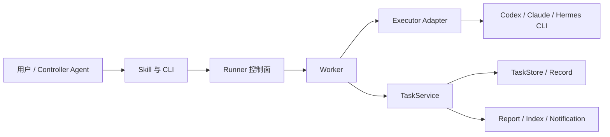
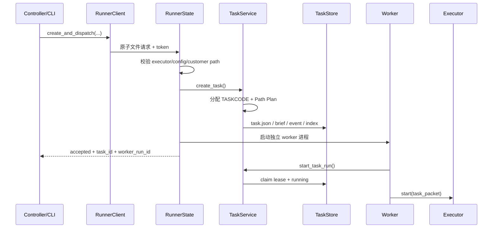
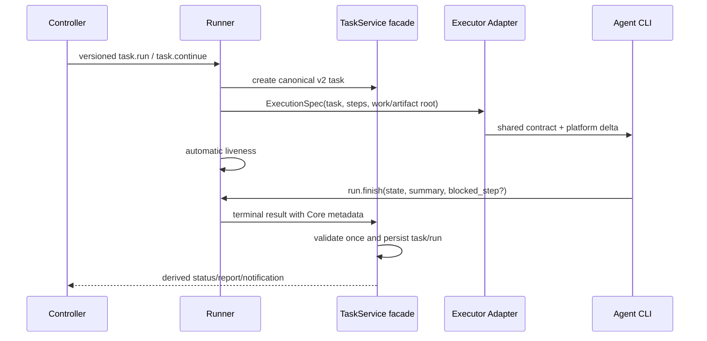

# AgentBC Alpha 至正式版开发手册

> 文档日期：2026-08-05；最近更新：2026-08-11
> 当前发布基线：AgentBC `1.0.1A3` / Python `1.0.1a3`
> `1.0.1A` 开发状态：已于 2026-08-08 截止，不再接收功能或常规缺陷改动
> `1.0.1A` 已验证代码截止：`private/integration` / `d2ce9d1f7489dadfc7458313a9216065fb1438c7`
> 当前私有开发阶段：`1.0.2A`，以稳定修订 `private/integration@cfddccba246e6d057172f6716ab4318ade9a40ad` 为开发基线
> 目标范围：`1.0.2A`～`1.0.5A`，以及结束 Alpha 的 `1.1.0`
> 本机唯一开发入口：`/Users/wangroway/hermes-team/codex/AgentBC_Temp/agent-worktrees/integration`
> 本机公开主线镜像：`/Users/wangroway/Documents/Work/Agent-Bridge-Connect/agent-bridge-connect`（只读）
> 私有分支：`private/integration`；Agent 固定分支：`agent/codex`、`agent/claude`、`agent/hermes`
> 合入与发布主机：MacBook；本开发机只允许向 MacBook 推送受保护私有分支，禁止操作或发布 `main`
> 仓库外备份：`/Users/wangroway/hermes-team/codex/data/20260805_AgentBC开发手册备份.md`
> 公开仓库：<https://github.com/roway49/agent-bridge-connect>
> 存放策略：手册由 `private/integration` 跟踪并在仓库外备份；MacBook 合入公开 `main` 时必须排除本文件
> 用途：后续开发的架构入口、模块地图、重构/协议迁移护栏、版本目标与验收清单

## 0. 如何使用本手册

本手册不是用户指南，也不是历史问题流水账。它回答四类开发问题：

1. 某个行为的唯一责任模块在哪里；
2. 一次任务从派发到终态经过哪些层；
3. 修改协议、状态、路径或 Executor 时必须同步哪些位置；
4. 哪些旧模块、兼容字段和重复逻辑不能继续扩展。

### 0.1 重构与协议变化标识

从 2026-08-05 起，手册使用以下标识，避免把“当前实现”和“目标设计”混为一谈：

- **【现状】**：当前公开版或私有集成分支已经存在的行为；
- **【重构目标】**：只改变模块边界、复用关系和可维护性，不应改变用户可见契约；
- **【协议目标】**：会改变 task/Runner/Executor/Skill 数据契约，必须有版本、双读和迁移期；
- **【不可偏离】**：重构和协议迁移中必须保持的产品安全或业务边界；
- **【落地版本】**：目标首次进入真实 Alpha 验证或正式启用的版本。

没有变化标识的正文默认描述 `1.0.1A` 基线。私有集成分支已经改变的行为，以本手册中
明确写出的“当前私有基线修订”为准。目标设计在对应版本合入前不是当前运行协议，开发者
不得用未来字段、未来状态或未来命令解释现有任务。

### 0.2 开发入口修订

本开发机只在固定 agent worktree 开发，并在审查后合入 `private/integration`。公开
`main` worktree 仅用于只读比对，不在本机 checkout 其他分支、不提交、不合并、不打 tag、
不向公开远端推送、不发布。本机只允许向 MacBook 的 `origin` 快进推送
`private/integration` 与 `agent/*`；公开主线合入、候选构建、tag、Release 和 PyPI
发布统一由 MacBook 完成。

手册作为私有运维文件由 `private/integration` 跟踪；MacBook 生成公开候选时必须显式
排除本文件，禁止把私有手册随代码整体推入公开 `main`。仓库外备份用于误删恢复，不是
并行编辑副本；内容更新只在 private/integration 完成，验收后再覆盖备份。

开始修改前，先执行只读基线检查：

```bash
cd /Users/wangroway/hermes-team/codex/AgentBC_Temp/agent-worktrees/integration
git status --short --branch
git log -3 --oneline
test "$(git branch --show-current)" = "private/integration"
agentbc runner status
agentbc task status
```

涉及既有任务时，再查：

```bash
agentbc task status <TASKCODE>
agentbc task report <TASKCODE-NNN>
agentbc task logs <TASKCODE-NNN>
```

不要从聊天内容、`accepted`、Task List 颜色或旧报告中的单条错误判断任务是否完成。

---

## 1. Alpha 版产品定位

AgentBC 是一个 **local-first 多 Agent 任务控制平面**。它不替代 Codex、Claude Code
或 Hermes，也不评价模型输出质量；它负责把跨 Agent 工作变成可派发、可追踪、
可恢复、可验收的结构化任务。

Alpha 版已经实现：

- Codex、Claude Code、Hermes 三类 Executor 的统一派发；
- 原子化 `create + dispatch` 与 `handoff + dispatch`；
- 四位人类可读任务码和链路迭代编号；
- customer path 与 AgentBC 托管路径两种工作模式；
- Task Brief、Report、Record、Artifact 所有权分离；
- Runner 外部执行、命令白名单、路径防护和单实例保护；
- Executor 退出守卫、Agent callback 补充信息和 RunLease 恢复证据；
- Task List、健康颜色、运行计时、终态通知；
- `status/report/logs/close/recover/reassign/handoff`；
- Codex 多图输入与 Hermes 单图输入；
- setup、Skill 安装、更新、清理和卸载；
- GitHub Release 与 PyPI 安装。

Alpha 版不保证：

- `completed` 等于产物质量合格；
- 任意上游 CLI 版本永久兼容；
- 跨机器派发、自动链式编排或完整 GUI；
- Linux、Windows 原生后台服务；
- Runner 重启后恢复所有内存态子进程；
- 当前公开仓库具备完整回归测试覆盖。

一句话边界：

> AgentBC 保证任务协议、执行证据和数据位置尽量可信；模型是否把工作做好，仍由报告、
> 产物和用户验收决定。

---

## 2. 必须长期保持的设计原则

### 2.1 单一事实来源

任务事实优先级：

1. `task.json` 中的当前状态；
2. `run_lease.json` 与 Runner/worker/Executor 进程证据；
3. Task Report、事件、步骤和错误记录；
4. 产物存在性、格式、尺寸、哈希等验收证据；
5. Agent callback；
6. Skill 文案、聊天回复和 Task List 展示。

低优先级信息不得反向覆盖高优先级事实。

### 2.2 四层职责分离



- **Skill**：告诉 Controller Agent 最短正确行为路径，不是安全边界。
- **CLI**：解析参数、调用服务、呈现结果，不拥有核心业务规则。
- **Runner**：在受控环境启动进程、维护 IPC 和执行白名单，不拥有任务语义。
- **TaskService**：生命周期、Path Plan、链路、终态、close/recover 的领域规则。
- **TaskStore**：原子持久化，不推断业务决策。
- **Executor Adapter**：把 Task Packet 翻译为上游 CLI，并解释退出结果。
- **Report/Notification**：展示已经确定的事实，不创造新事实。

### 2.3 路径先规划再执行

所有任务必须先得到完整 Path Plan。Agent 只提供 `customer_path`：

- 用户未指定工程路径：传入字面值 `default path`；
- 用户指定工程或文件：传入实际路径；
- `customer_dir` 由 Core/Runner 推导，Agent 不判断 `allowed_roots`；
- Runner 根据已验证的 Path Plan 增加 task-scoped root；
- 禁止为规避权限而复制用户工程到 AgentBC workspace。

### 2.4 Agent 不拥有报告和状态

- Agent 可写用户产物；
- Agent 只能声明流程结果，不能填写或覆盖 Core 已知的身份、路径和运行事实；
- Agent 不直接写 `task.json`、Record、Task Brief、Report、Index；

**【现状：公开 `1.0.1A`】** callback 是可选摘要，正常 Executor 退出曾作为完成依据。

**【当前私有基线修订】** `private/integration` 已采用严格 flow marker：零退出但缺少有效
`AGENTBC_FINAL_CALLBACK`、task ID 不匹配、步骤缺失/重复/未完成时必须 `failed`；显式
可重试传输失败才进入恢复路径。旧 Skill 若仍称 callback 可选，属于协议漂移，不能据此
修改 Core 回退到旧行为。

**【协议目标｜`1.0.4A` 预览，`1.0.5A` 默认】** 用 run-token 绑定的结构化 finish sidecar
替代 Agent 在正文中手写完整 JSON。Agent 最终只声明 `completed + summary`，或
`input_required + blocked_step + summary`；task ID、版本、step 集合、路径和时间由
Runner/Core 自动补齐。

**【不可偏离】** 缺少当前 run 所要求的明确完成信号仍然 `failed`；协议精简不能恢复
“退出码 0 自动完成”，也不能把 `completed` 扩大成产物质量已验收。

### 2.5 用户工程优先保护

- `close`、`record clean`、`uninstall` 永远不能删除 customer project 内容；
- 链路后续迭代可能已经修改共享产物，AgentBC 不保存回滚副本；
- 自动清理只能处理 Path Plan 证明属于 AgentBC 的托管目录；
- 清理函数必须做 root containment 检查，不能仅按目录名猜测所有权。

### 2.6 有界记录与原子写入

- 单迭代 Record 预算为 `10KB`；
- 日志和诊断字段应截断或保留尾部，不允许无限增长；
- JSON、请求、响应、Skill 安装使用临时文件加原子替换；
- 重试、callback、终态同步和 close 应尽量幂等；
- 大产物、完整模型输出和长日志不得塞进 `task.json`。

### 2.7 产品运维优化总变化边界

代码重构与协议优化统一归入“产品运维优化”，但实施时仍必须区分两类提交：

| 范围 | 当前问题 | 预期变化 | 不可偏离 |
| --- | --- | --- | --- |
| Service | 生命周期、链路、干预、查询集中在巨型文件 | 保留 `TaskService` 门面，内部拆为 lifecycle/lineage/intervention/resolution | 公共 API、task 状态和磁盘语义不随机械拆分改变 |
| Runner | IPC、进程、派发、Dashboard 混合 | 拆为 IPC/process/dispatch/dashboard；加入协议握手 | Runner 不成为第二套 TaskService |
| CLI | parser、展示、worker、领域编排混合 | parser、query、command handler 分离 | CLI 不新增业务规则 |
| Setup | discovery、Skill、配置、卸载混合 | discovery/skill/config/uninstall 分离 | 不扩大删除范围，不隐式携带凭据 |
| Executor | 三类 Adapter 重复生命周期与 prompt | 公共 ExecutionSpec、prompt builder、terminal/failure contract | 平台命令、权限和输出解析仍由各 Adapter 负责 |
| 数据协议 | workspace、lineage、状态、step record 多套表达 | v2 规范写入、v1 双读、派生视图单向生成 | 不原地改写活跃任务，不删除历史读取能力 |
| Agent 协议 | 手写 YAML、progress、完整终态 JSON | 简化创建命令、自动 liveness、结构化 finish | 安全和正确性不能只靠 Skill 文案 |

机械重构和协议语义变化不能在同一个提交中完成。正确顺序是：建立 characterization/golden
测试 -> 机械迁移 -> 验证无行为变化 -> 单独引入版本化协议 -> 真实 Executor 验收。

---

## 3. 用户可见身份与数据模型

### 3.1 任务 ID

```text
TASKCODE       例如 4XMC，表示整条任务链
TASKCODE-NNN   例如 4XMC-001，表示某次精确迭代
```

- 默认任务码长度为 4，字符集排除易混淆字符；
- 使用安全随机生成并与现存 TaskStore 目录去重；
- 当前长度容量耗尽后自动增加位数；
- `001/002/003` 只表示同一链路内的迭代顺序；
- handoff 复用 `TASKCODE`，增加 iteration；
- 根任务被真正 close 后，任务码可重新进入可用池；
- 后续链迭代 close 时不释放任务码。

唯一实现入口是 `task_id.py`。新代码不得重新实现 ID 正则、字符集或随机分配。

### 3.2 主任务模型

权威模型是 `protocol.py::TaskModel`，关键字段包括：

- `id`、`title`、`status`、`assignee`；
- `steps`；
- `created_by`、`created_at`、`updated_at`；
- `workspace`：完整 Path Plan；
- `extensions`：provenance、lineage、execution、media、callback 等扩展；
- `intervention`：暂停、纠正等人为操作。

`ExtensibleModel` 会保留未知字段。新增正式字段前，先判断它属于稳定协议字段还是可选
扩展；实验信息优先放入命名空间化的 `extensions`。

**【协议目标｜`1.0.4A` 起双读】** v2 模型只保存一份 canonical path 和一份 lineage。
`root/default_path/project_root`、`artifact_root/artifacts_dir`、`report_root/output_dir`、
`chain_id/chain_token/chain_dir` 等同义字段停止在新任务中重复写入。`task_file`、
`report_file`、record dir 能从 Core 根目录与 task ID 推导时不进入 Executor 输入。

**【兼容要求】** `ExtensibleModel` 和 v1 reader 继续读取旧字段；任何字段删除前必须统计
历史 task 使用情况。`1.1.0` 不删除 v1 reader。

### 3.3 步骤文件

`steps.yaml` 是创建任务的结构化输入，至少包含一个非空 `description`。解析逻辑位于
`service.py::load_steps`。

不要在 Skill 中发明另一套 steps 格式。格式变更必须同步：

- `load_steps` 与单元测试；
- 三类 Skill；
- `skills/references/agentbc-steps-yaml.md`；
- Quick Start/User Guide 示例。

**【协议目标｜`1.0.4A` 内部预览】** 普通 Controller 调用支持可重复 `--step`，不再强制
创建临时 YAML；YAML 继续作为批量/高级入口。无用户路径时省略 `--path`，不再要求 Agent
传入字面值 `default path`。在新命令正式发布前，现有 `steps.yaml + --customer-path`
仍是有效 v1 契约，不能提前从 Skill 删除。

---

## 4. 目录与所有权

### 4.1 稳定目录结构

```text
~/Documents/AgentBC/workspace/
├── tasks/
│   ├── artifacts/
│   │   └── YYYY-MM-DD/TASKCODE/              # 仅 default path 托管产物
│   └── report/
│       └── YYYY-MM-DD/TASKCODE/
│           ├── TASKCODE-NNN-task.md           # Core 生成 Task Brief
│           └── TASKCODE-NNN-report.md         # Core 生成 Report
└── record/
    ├── README.md                              # Record 说明
    ├── TASK_INDEX.md                          # 人类可读全局索引
    ├── task_index.jsonl                       # 机器可读全局索引
    └── TASKCODE/NNN/
        ├── task.json                          # 权威任务状态
        ├── events.jsonl                       # 有界事件
        ├── interventions.jsonl                # 有界人工操作
        ├── lease.json                         # TaskStore 领取锁
        ├── run_lease.json                     # Executor 生命证据
        ├── .TASKCODE-NNN.run.temp             # 最近进度时间戳
        └── TASKCODE-NNN-run.log                # 极小运行日志
```

其他运行路径：

```text
~/.abc/config.toml                             # 用户配置
~/.abc/runner/runs/<runner-run-id>/            # Runner 进程元数据和输出
/tmp/agentbc-runner-v2-<uid>/                  # IPC spool 和 token
```

### 4.2 两种产物模式

| 模式 | 输入 | `project_root` / `artifact_root` | 报告位置 |
| --- | --- | --- | --- |
| 用户工程 | 明确路径 | 用户指定目录；文件路径归一到父目录 | AgentBC `tasks/report` |
| 托管模式 | `default path` | `tasks/artifacts/YYYY-MM-DD/TASKCODE` | AgentBC `tasks/report` |

同一链路跨天 handoff 时仍使用根任务创建日，防止一条链分裂到多个日期目录。

### 4.3 路径实现边界

- `path_model.py`：生成和验证 Path Plan；
- `config.py`：默认 workspace、record root 与稳定 Runner roots；
- `runner.py`：根据已存 Path Plan 验证本次命令 task-scoped roots；
- `media.py`：校验图片输入位于允许的 project/AgentBC roots；
- `task_health.py`：清理时验证目录所有权；
- Executor 只消费路径，不重新推导。

`PathPlan.to_workspace()` 仍输出 `chain_id/chain_token/chain_dir/chain_task_id` 等旧兼容
别名。它们属于技术债，新代码必须使用 `task_code/iteration/task_date` 和明确路径字段。

### 4.4 路径与记录 v2 预期变化

**【重构目标】** Path Plan 仍由 `path_model.py` 唯一计算；拆文件不允许出现第二套推导。

**【协议目标】** 新任务的持久字段收敛为 `mode/project_root/artifact_root/report_root/task_date`
及独立的 `code/iteration/parent_id/root_id/branch` lineage。Executor 只接收
`work_root` 和 `artifact_root`，不接收 report/record 内部路径。

Record 目标结构：

```text
TASKCODE/NNN/
├── task.json       # 唯一持久化任务事实
├── run.json        # 当前/最近一次进程与 liveness 证据
└── events.jsonl    # 生命周期和 intervention 的统一有界事件流
```

- v2 不再创建空 `steps/NN.json`；
- `interventions.jsonl` 合入统一事件流；
- progress temp 逐步并入 run record；
- Report、Index、Notification、GUI 都是派生视图，不得反向覆盖 task/run。

**【不可偏离】** v1 目录保持可读；活跃、paused、input_required 或待恢复任务不做原地迁移；
customer project、托管 artifact 和 Core report 的所有权边界不改变。

---

## 5. 状态、终态与健康颜色

### 5.1 三个不同概念

必须区分：

1. **任务状态**：持久化在 `task.json`，是业务事实；
2. **RunLease 状态**：Executor 进程是否仍可证明存活；
3. **健康颜色**：Task List 对最近进度证据的低成本展示。

Task List 的 `timer` 只是展示计时，不推动任务状态，也不证明 Executor 仍在工作。

### 5.2 Alpha 用户终态

| 终态 | 含义 | 不能推导出的结论 |
| --- | --- | --- |
| `completed` | Executor 正常启动并确认正常退出 | 产物质量合格、需求全部满足 |
| `needs_recovery` | 任务未能正确启动或继续执行 | Agent 一定没有生成文件 |
| `failed` | 任务启动过，但正常结束流程无法确认 | 产物一定不可用 |

`input_required` 不是终态，而是 running 的可恢复等待子状态。它必须继续留在 active
cohort，不能写 `agentbc.final_callback`，也不能触发终态 Report/Notification。

`cancelled/rejected` 仍存在于底层协议和人工干预路径，但不属于
`terminal_states.py::TASK_TERMINAL_STATES` 的三种通知终态。状态集合仍有分散，新增
状态前必须先统一定义，禁止再增加第四套列表。

### 5.3 健康颜色

`task_health.py` 当前规则：

- 灰色：pending、inactive 或 completed；
- 绿色：启动宽限期内，或最近进度不超过 300 秒；
- 黄色：等待 `input_required`，进度文件缺失，或 300～600 秒未更新但进程未证明丢失；
- 橙色：超过 600 秒未响应，但 Runner/进程尚未证明丢失；
- 红色：`needs_recovery`、`failed`，或 RunLease 证明进程丢失。

启动后 10 秒是 temp 创建宽限期。Task List 每 20 秒重绘只读取时间戳和小文件；它不
轮询模型进度、不修改任务状态，也不启动每任务监视器。

### 5.4 两种 lease

| 文件 | 模块 | 用途 | 生命周期 |
| --- | --- | --- | --- |
| `lease.json` | `TaskStore` | 防止同一任务被两个 worker 同时领取 | 领取时创建，终态时释放 |
| `run_lease.json` | `run_lease.py` | Executor PID、PGID、heartbeat、孤儿或 suspended 状态 | Executor 启动到退出/等待/恢复判定 |

两者名称接近但职责不同。后续可将前者在代码层改称 `claim_lease`，但完成兼容设计和
回归测试前不要直接改文件格式。

合法 `input_required` 会释放 `lease.json` 的领取权，并把 `run_lease.json` 持久化为
`suspended`。suspended 不参与 stale/orphaned 计时；Runner 重启后仍从 task extension 和
RunLease 恢复等待事实。收到响应后创建新的 Executor run，而不是恢复旧进程。

### 5.5 状态与健康协议预期变化

**【协议目标】** 用户任务状态最终收敛为：

```text
pending -> running <-> paused
                  -> input_required
                  -> completed
                  -> failed
                  -> cancelled
```

`needs_recovery` 不再作为一套平行生命周期，而表达为
`failed + failure.retryable=true`；`recover` 只对可恢复失败重新排队。TaskStatus、
RunnerProcessStatus、RunLeaseState 和 HealthColor 使用显式类型，只在边界函数转换。

**【运行目标】** liveness 由 Runner/Adapter 根据 PID、RunLease、stdout/stderr 或原生事件
自动维护；Agent 的 progress 摘要降级为可选信息。黄色/橙色仍表示观察窗口内无机器活动，
不是失败；重新出现活动后必须恢复绿色。

**【落地版本】** `1.0.4A` 双读/影子输出，`1.0.5A` Docker/OpenCode 实际验证，
`1.1.0` 正式收口。状态迁移不能与 GUI 开发同时设计；GUI 只消费冻结后的 StatusView。

---

## 6. 任务主调用链

### 6.1 Create + Dispatch



`accepted` 只表示 Runner 已创建 worker，不表示 Executor 已启动，更不表示任务完成。

原子派发失败时，Runner 将新任务标为 `needs_recovery`、生成报告并刷新 Task List；不能
留下表面 pending、实际不会启动的孤儿任务。

### 6.2 Worker + Executor

Worker 是通用执行编排层：

1. 领取 TaskStore lease；
2. 将任务置为 running；
3. 从 `executor_registry.py` 构造 Adapter；
4. Adapter 构建安全 CLI 参数和 Task Prompt；
5. 创建并持续更新 RunLease/进度 temp；
6. 读取 Executor 退出码、输出事件和可选 callback；
7. 调用 TaskService 完成终态；
8. 写报告、索引、通知并清理 temp。

不要让每个 Adapter 各自实现一套 TaskService 状态机。Adapter 只返回统一 `PollResult`
和必要执行证据。

### 6.3 正常完成

**【当前私有基线】** 正常完成必须同时满足：Executor CLI 返回 0，且输出中存在唯一、
合法、与当前 task ID 和全部声明步骤匹配的 `AGENTBC_FINAL_CALLBACK`。Adapter 先解析并
结构化路由，worker 再调用 `finalize_task_from_executor_exit()`，Service 第二次校验后写入
task、Report、Index 和 Notification。

`record_agent_callback()` 与 `task callback` 只保留兼容元数据，不替代当前 run 的
mandatory marker。公开 `1.0.1A` 的“零退出即可完成”是历史协议，不得进入新实现。

**【协议目标】** v2 改为一次 run 绑定的 `agentbc run finish` sidecar。Runner 自动补齐
task ID、version、step IDs、executor run ID、时间和 Core 路径；Agent 不再在正文复制
完整 JSON。一次 run 创建时固定 `completion_contract=v1|v2`，只能接受指定协议，禁止
同时解析两套完成信号或根据自然语言猜测。

**【不可偏离】** `completed` 的 outcome 仍为 flow-completed/unverified，不表示用户验收；
Report 与产物质量继续由用户或下一 Agent 验收。

### 6.4 异常完成

- 缺少、重复或无效完成信号，以及非零退出，默认进入 `failed`；
- 只有 Adapter 能给出结构化 `retryable=true` 的传输/基础设施失败才进入恢复语义；
- 权限、审批或预算耗尽但没有合法 `input_required` 声明时仍为 `failed`；
- **【CFG-002 落地后】** Adapter 能识别的资源耗尽（Claude `Exceeded USD budget`；
  Hermes `max_iterations_reached(N/M)`、`budget_exhausted`、
  `Iteration budget exhausted (N/M)`、`Reached maximum iterations (N)`）不再直接
  failed，转为 `input_required`（`type=choice`）弹窗决策：approve 翻倍资源并
  `--resume` 继续，deny 以 `failed` 终态并携带明确原因
  （`budget_exhausted_user_terminated`/`iteration_exhausted_user_terminated`，
  `retryable=false`）；未启用决策或用户终止时才进入终态；
- Hermes 迭代耗尽在进入终态时统一分类为 `iteration_budget_exhausted`
  （`retryable=false`）；Adapter 同时在结果与 `extensions.executor.hermes` 记录
  `iteration_used/iteration_limit/iteration_exhausted/iteration_source`（不含密钥或正文）；
- Hermes 校验 final marker 前先剥离已知的 `Query:`/任务 prompt 回声（prompt 内含示例
  marker），只检查实际最终回复；真实回复内仍出现多个 marker 时照旧判
  `completion_marker_duplicate`；
- RunLease 可拒绝晚到或与 cancel/recovery 冲突的完成声明；
- `recover` 只重置为可重试状态，不自动执行；必须重新 dispatch 同一 ID。

**【协议目标】** failure 统一为 `kind/layer/message/retryable`，Worker/Core 不再根据 Agent
自然语言决定是否恢复。各 Adapter 可以解析上游文本，但必须输出同一结构；无法判断时
默认不可自动恢复。

私有候选 `d06b150` 增加 30 秒 worker finalize 宽限：Executor PID 已退出但 worker
仍活着时，不立即误判 failed。进入公开版前必须保留对应回归测试。

### 6.5 Input Required + Respond

合法 `input_required` marker 至少指出一个 blocked step。Core 在 `agentbc.input` 中只保留
一个 active request：`input_id`、`executor_run_id`、`blocked_step_id`、`type`、脱敏
`summary`、`created_at`、`deadline_at`、`status=waiting`，以及可选的脱敏
`requested_permission`。`choice` 还必须保存具体 `reason`、两个按钮 label 和逐项
description；默认 deadline 是 24 小时。

等待路径必须满足：

1. 保留已完成 step，只把 marker 指出的 step 记为 blocked；
2. 释放 claim lease，把 RunLease 置为 suspended，并暂停 stale 与执行耗时；
3. 不写 `agentbc.final_callback`，不写终态 Report，不发终态通知；
4. 立即发送非终态 input notification。桌面窗口只展示 Task ID、blocked step、具体阻塞原因、
   两个方案说明和直接操作按钮，不展示 deadline 或 CLI respond 命令；deadline 与精确
   `agentbc task respond` 仍保存在通知事件、任务状态和报告中作为运维兜底；
5. Task List 保持黄色、open；read-only list/status/report 不得推进 24 小时到期状态。

**资源耗尽类 choice（CFG-002）**：Adapter 检测到 Claude 预算或 Hermes 迭代耗尽时，
以 `type=choice` 声明 input_required，桌面弹窗两按钮：「提高预算并继续」与
「终止任务」。

- approve 按任务级翻倍当前资源（Claude `max_budget_usd` ×2、Hermes `max_turns`
  ×2），仅本次任务生效，不写全局配置；配合 SESSION-001 以 `--resume` 继续同一
  Executor 会话，不新建会话重建上下文；
- deny 将任务终态置为 `failed`，failure 携带明确原因
  （`budget_exhausted_user_terminated`/`iteration_exhausted_user_terminated`），
  `retryable=false`；
- 等待期间任务临时会话必须保留并记录 `session_id`（SESSION-001 的
  `input_required` 例外），resume 派发直接继续该会话。

用户响应的唯一运行入口是：

```bash
agentbc task respond TASK_ID --input INPUT_ID --message "..." --config ~/.abc/config.toml
agentbc task respond TASK_ID --input INPUT_ID --approve --config ~/.abc/config.toml
agentbc task respond TASK_ID --input INPUT_ID --deny --config ~/.abc/config.toml
```

三种响应形式互斥。Runner 在一个锁域内验证 current chain head、current input ID、waiting、
deadline 和无 active executor，写入脱敏 response audit，只把 blocked step 重置 pending，转为
running/resuming 并派发同一 Task ID、同一 worktree 的新 Executor turn。重复响应返回
`already_answered`，不重复派发；旧/错误 input ID 返回 `stale_input`。新 prompt 同时包含上次
请求、用户响应和已完成 step 证据。

Runner 启动后及周期 maintenance 负责扫描 deadline。到期转 `needs_recovery` 并写精确证据；
Task List、status、report 等只读渲染不得执行该变更。resume dispatch/context 失败同样进入
`needs_recovery`。最终成功时才写唯一真实 `agentbc.final_callback`、Report 和终态通知。
`task resume` 仍只处理 pause，`task retry --step` 仍只处理单 step。input response、retry、
recover 和 re-dispatch 都保留当前任务的 `agentbc.permission`，不能重新套用配置默认值。
普通 input 响应默认不保留通用 Executor session；资源耗尽类决策与 SESSION-001
enable 场景按会话保留策略执行（input_required 期间保留并 `--resume` 继续）。

### 6.5.1 执行权限契约

权限契约只有 `inherit`、`safe`、`full` 三个规范值，持久化在向后兼容的
`extensions["agentbc.permission"]`：`requested_mode`、`effective_mode`、
`selection_source`。优先级固定为显式 task option > handoff 源任务 > 配置默认值 > legacy
`safe` 回退；requested/effective 不一致时禁止静默降级。`inherit` 不注入 AgentBC permission、
approval、sandbox、safe-mode、yolo 或 writable-root 覆盖；`safe` 保持原有保守行为；`full`
必须持久化并审计，只允许已安装 CLI 帮助中明确支持的最强非交互机制。未知值在创建/派发前
失败，旧配置和旧任务永远不会因升级静默获得 `full`。

权限模式不改变 Path Plan、Runner cwd/allowed-root 授权、RunLease、strict final marker、
secret redaction、input_required、model/effort/budget/tool/timeout/session/transport 等合同。

**【1.0.3A 协议目标】** 当前多来源优先级与 Hermes `safe`/`inherit` 同 argv 的语义歧义
将在统一权限治理中收口。用户通过一个 AgentBC 全局设置选择后续新派发任务的 `safe` 或
`full`，新的根任务与新协议 handoff iteration 在创建时冻结映射；同 Task 的 retry、recover、
input response 与 resume 保持原快照。权限阻塞不再依赖 Agent 自行输出 marker，而由 Adapter
上报绑定官方 session/run/request 的结构化 approval event，Core 统一转
`input_required(type=permission)`。详细契约与迁移门禁见
`AGENTBC_1.0.3A_DEVELOPMENT_CHECKLIST.md`。

**【1.0.2A 过渡门禁】** 在上述协议发布前，每次新根任务或 handoff 派发前由控制端人工
确认目标 Agent 所需 `safe`/`full`，并显式传入 `--permission-mode`；`full` 必须逐次说明
风险并取得授权。不得依赖隐式继承，也不得为此在 `1.0.2A` 增加权限弹窗、approval event
或统一权限配置。retry/recover/resume 继续使用已冻结权限。

**【SAFE-001｜1.0.2A P0】Codex safe 与 linked worktree**：Codex safe 的
`workspace-write` 可以修改 customer worktree，但 linked worktree 的 `.git` 指向主仓
`.git/worktrees/<name>`，object/ref 等共享 Git 元数据通常位于 task-scoped writable root 外。
因此“源码与测试完成、`git add/commit` 被拒绝”是可预检的权限边界，不是 Agent 理解失败。

- 派发前记录 checkout 类型、`git_dir`、`git_common_dir`、branch/HEAD，并使用
  realpath/containment 判断 Git 元数据能否写入；
- safe 下需要 Git 写入且 linked 元数据越界时，以
  `codex_safe_git_metadata_blocked` 进入可接管 `input_required`，保留变更和测试证据；
- 默认由控制端审查当前 worktree 变更并提交，再用 commit SHA 恢复同一 Task ID/会话；
  Executor 只复核 HEAD、clean tree 和步骤证据；
- 普通 message 响应不具有提权能力，不能再次派发同一个必然失败的 commit 尝试；
- safe 禁止把整个 `git_common_dir` 加入 writable roots，禁止自动切换 `full`，禁止写
  `main`、其他 agent 分支或其他 worktree refs；若以后提供 Runner Git proxy，也只能对精确
  当前 worktree/branch 运行 allowlist Git 动作并完整审计。

### 6.6 Handoff

handoff 只允许从 `completed` 的当前 chain head 发起。活跃 `input_required` 必须返回
`input_pending`，先响应并完成同一任务，再决定是否 handoff：

- 默认禁止从 stale iteration 继续；
- 多 head 时必须消除歧义或显式使用 branch；
- 保留 task code、创建日、project/artifact root 和 lineage；
- iteration 自动加一；
- 未给 `--permission-mode` 时继承源任务权限，显式值覆盖；
- Task Brief 引用上一迭代 task/report；
- compact record 已清理时，可由 `agentbc task report` 恢复上下文；
- 图片输入默认继承，也可显式覆盖。

依赖既有产物的继续工作必须 handoff。`create_task()` 会拒绝把已有托管 artifact root
当作新根任务，避免 Agent 偷偷新建孤立 ID。

### 6.7 Close、Cancel 与 Recover

`close` 是让任务退出当前记录体系，`cancel` 是保留取消状态和证据。

当前 close 流程：

1. `plan_task_close()` 确认任务是当前 chain head；
2. 允许 pending 或活跃状态，拒绝终态/cancelled/rejected；
3. 后续迭代要求用户确认无法回滚产物；
4. `reserve_task_close()` 写 close intent，防止进程取消与终态落盘竞态；
5. CLI 先通过 Runner 取消 executor run 和 worker run；
6. 取消成功后 `commit_task_close()` 才删除记录；
7. `001` 根任务删除 Core 报告、托管产物、Record 并释放 task code；
8. 后续迭代只删除本迭代 record/task/report，保留前序、task code 和共享产物；
9. customer project 永远不删除。

注意：当前 Record README 模板仍写 pending close 会被拒绝，与 Service 实现不一致；
这是文档漂移，应修正文案，不能为匹配旧说明回退正确行为。

### 6.7 v2 主调用链目标



此目标只减少重复表达，不减少严格性。Runner/Core 已知的字段不再让 Agent 重抄；Agent
仍必须显式结束当前 run，否则任务失败。

---

## 7. Runner 设计

### 7.1 Runner 为什么存在

Runner 解决 IDE/Agent 父沙箱无法直接访问用户 CLI、profile、日志目录和 customer
path 的问题。它不是第二套任务系统，也不是通用 shell server。

IPC 使用同一用户下的原子文件邮箱：

```text
/tmp/agentbc-runner-v2-<uid>/
├── requests/
├── processing/
├── responses/
└── token
```

- 请求包含随机 ID、token 和过期时间；
- 临时文件写完后 `replace()` 发布；
- Runner 原子移动请求完成认领；
- 单次请求和输出有大小限制；
- CLI 请求超时只是 IPC 应答超时，长任务在独立 worker 中继续；
- 一个 Runner 循环服务多个任务，不为每任务创建常驻 watchdog。

### 7.2 安全边界

- 只允许运行登记过的 Executor 可执行文件；
- 命令必须匹配各 Executor 的固定子命令和该任务权限映射；
- Runner 从持久化 current task 重新读取 requested/effective/source，拒绝缺失、stale、篡改或
  不匹配的授权；inherit/safe 继续拒绝危险参数，只有持久化 `full` 可接受精确映射；
- 权限命令按语义而不是原始拼写比较：Codex 的 `-s`/`--sandbox`、`-a`/`--ask-for-approval`
  及其等号写法必须归一，Claude 的 permission/safe/settings 入口和 Hermes 的 yolo、hook、
  config/rules/safe-mode/oneshot 入口同样纳入；重复、冲突、缺值、raw config/settings、profile
  或未授权替代映射一律 fail closed；
- 不接受用户原始 command flags；审计事件只记录 task id、executor、requested/effective、
  selection source 和时间，不记录 prompt、command 或 secret；
- `subprocess.Popen(argv)`，不使用 `shell=True`；
- cwd 必须位于 stable roots 或任务 Path Plan 推导的 task-scoped roots；
- Codex safe 不得因 linked worktree 提交需求而广泛放行主仓 `git_common_dir`；默认使用
  SAFE-001 的控制端审查提交路径。自由文本 input 响应不改变持久化权限，任何 safe→full
  转换都必须走显式任务授权并产生审计记录；
- managed report write 只允许符合任务报告命名的文件；
- spool 权限为用户私有，信任模型是同主机同 OS 用户；
- Runner 启动前检查既有 PID/identity，拒绝第二个真实实例。

### 7.3 两个进程层级

```text
Runner
└── worker:<executor>          # AgentBC worker，负责状态和终态
    └── executor CLI           # Codex / Claude / Hermes
```

任务元数据同时保存 `worker_run_id/worker_pid` 与 `executor_run_id/executor_pid`。
close 时两层都要取消；RunLease 主要跟踪 Executor，finalize 竞态还要查看 worker 是否
仍存活。

### 7.4 Task List cohort

Runner 在首个任务派发时注册本轮 cohort 并打开一个 Task List Terminal：

- 同一 cohort 后续任务加入同一窗口；
- 只展示本轮任务，不扫描全部历史任务；
- 完成任务在本轮列表中显示 completed，失败显示 failed；
- 所有成员到达终态后自动退出并关闭窗口；
- dashboard protocol 变化时先关闭旧进程，避免两个窗口并存；
- refresh 文件用于唤醒重绘，不等于任务 heartbeat。

`task_health.py` 同时包含健康判断、cohort 文件和部分清理函数，职责已经偏重。后续应
拆分为 `health.py`、`dashboard.py`、`cleanup.py`，但拆分前先恢复测试。

### 7.5 Runner 重构与协议目标

- **【重构目标】** `runner.py` 拆为 IPC、process、dispatch、dashboard；先保持
  `RunnerClient/RunnerState` 门面，再机械移动实现；
- **【协议目标】** IPC 外层统一为 `protocol/request_id/op/payload`，Runner health 返回
  protocol/completion/schema 版本；不兼容时派发前失败；
- **【运行目标】** Runner 自动记录进程和输出活动，不要求 Agent 定时 heartbeat；
- **【当前输入恢复】** `RunnerState.respond_and_dispatch()` 原子记录 response 并派发同一
  Task ID；`maintain_waiting_inputs()` 是 24 小时 deadline 状态变更的唯一维护入口，Runner
  restart 后继续读取持久化等待请求；
- **【Docker边界】** Docker Runner 只运行容器内登记的 Executor，不自动调用宿主机
  Codex/Claude/Hermes，也不继承宿主凭据；
- **【不可偏离】** token、过期时间、原子发布、命令 allowlist、task-scoped roots、
  单实例和大小限制全部保留。

---

## 8. Executor Adapter 约定

### 8.1 统一接口

`adapters.py::ExecutorPort` 定义能力、探针、启动、轮询、取消等接口。
`executor_registry.py` 是构造 Executor 的唯一入口，并区分：

- runtime keys：真的传入构造器；
- metadata keys：配置描述，不传入构造器；
- unknown keys：立即拒绝，避免拼写错误静默失效。

### 8.2 当前三类 Executor

| Executor | 当前模式 | 主要能力 | 重点约束 |
| --- | --- | --- | --- |
| Codex | `codex exec --json` | 结构化事件、多图、图片生成/编辑、模型选项 | safe=`--sandbox workspace-write`；full=`--dangerously-bypass-approvals-and-sandbox`；inherit 不覆盖 |
| Claude | headless print | 文本与代码、模型/effort 配置基础 | safe=`--safe-mode --permission-mode acceptEdits`；full=`--dangerously-skip-permissions`；inherit 不覆盖 |
| Hermes | direct/runner transport | profile/provider/model、文本、单图输入 | safe/inherit 都保留正常危险命令审批且不启用 troubleshooting safe-mode；full=`--yolo`；final marker 只校验实际回复 |

full 映射必须由最终配置指向的安装版 CLI `--help`/子命令帮助探测；缺少精确机制返回
`unsupported_permission_mode`，禁止猜测、降级或改动模型、预算、工具、超时、会话和 transport。

当前私有基线的三者 Prompt 必须共同包含：

- Task ID 与步骤；
- `project_root`、`artifact_root`、`report_root` 区别；
- 用户产物只能写 artifact/project；
- Report/Record 由 Core 管理；
- 遇到路径拒绝不得复制工程；
- 当前版本要求的严格 final marker；
- 退出码与 final marker 共同决定完成；
- resumed turn 注入 prior request、脱敏 user response 和每个 step 的当前状态；
- 长任务可低频写进度，不要求高频心跳。

**【已确认冗余】** Codex/Hermes 当前把公共规则放在 step 循环中，多步骤任务会重复注入
相同路径、报告、progress 和终态说明。重构后公共规则必须只出现一次，10 步 prompt
目标不超过约 3,000 字符。

### 8.3 新增 Executor

至少改动：

1. `executors/<name>.py`；
2. `executor_registry.py` 的 import path 和 runtime keys；
3. `setup.py` 与 `path_provider.py` 的发现/探针；
4. `runner.py` 的命令规则和 allowlist；
5. Skill/用户文档中的能力说明；
6. probe、dispatch、正常退出、非零退出、cancel、两种路径测试；
7. 真实 CLI smoke，而不只是 mock。

不要在 `runner.py` 中写一套该 Executor 的业务状态机，也不要在 Adapter 直接写
TaskStore。

### 8.4 OpenCode 与公共 Executor Contract

**【亮点版本｜`1.0.5A`】** OpenCode 成为第四类正式 Executor，并与 Docker profile
共同承担短期全平台覆盖。第一版至少支持 run、结构化/可解析事件、cwd、cancel、可选
model、report/log/failure、setup discovery、Controller Skill 和真实 CLI smoke。

**【重构目标】** 四个 Executor 共用：

- 最小 `ExecutionSpec`；
- 公共 prompt contract builder；
- RunLease/liveness 生命周期；
- terminal result 与 failure schema；
- 结果摘要和 Core metadata 构造。

各 Adapter 只保留上游 CLI argv、权限、输出事件和平台错误解析。Hermes transport 等真实
平台差异不能为了减少行数被塞进通用条件树。

**【Docker验收】** amd64/arm64 镜像至少包含 AgentBC Core、Runner、OpenCode、CLI、
doctor health check、versioned image 和 Compose 示例；在 macOS、Linux、Windows
Docker Desktop 完成 smoke。不得宣传为原生 Windows/Linux Runner。

---

## 9. Report、Record、Index 与通知

### 9.1 四类数据

| 数据 | 面向对象 | 内容 | 是否可清理 |
| --- | --- | --- | --- |
| Task Brief | Executor/用户 | 需求、步骤、路径和上轮上下文 | 活跃/验收期保留 |
| Report | 用户/后续 Agent | 状态、时间、路径、步骤、错误、产物、lineage | `record clean` 不删除 |
| Record | Core | task.json 和有界运行诊断 | 终态诊断可 clean，task.json 保留 |
| Index | 用户/Agent | 标题、结果、task/report 定位 | 长期保留、Core 重建 |

全局 Index 不记录 artifacts 和 task_file。先凭简短描述定位 task/report，再从 Report
获取详细路径，避免复杂任务把索引撑大。

Report 同时展示 `execution_duration`、`waiting_duration` 和 wall duration；等待区间只计入
`waiting_duration`，不得让 24 小时输入窗口虚增执行耗时。waiting 期间不自动生成终态
Report，但显式只读 `task report` 可以根据持久化状态渲染非终态视图。

### 9.2 10KB 的真实含义

Record 预算限制每次迭代的内部运行记录，不是 Report 和用户产物。`task.json` 终态时
压缩扩展字段，JSONL 保留有限行，诊断文本有长度上限。

不得为了满足 10KB 截断关键退出码、最终状态或 Path Plan。优先级：

1. 保留身份、状态、路径、lineage 和最终错误；
2. 保留最近事件与 intervention；
3. 压缩重复中间事件；
4. 丢弃大 stdout/stderr 和模型原文；
5. 大证据转移到 Runner run 日志或用户产物。

### 9.3 通知

`notifications.py` 是终态通知唯一实现：

- 标题固定 `Agent-Bridge-Connect`；
- 只含 Task ID+终态、最小标题、派发者->执行者、耗时、Report；
- 每个终态先写 `notifications.jsonl`，再发桌面弹窗；
- 与前一终态时间相差不超过 10 秒时，延迟 10 秒发送；
- 延迟只用于错峰，不查询活跃任务状态，也不丢弃通知；
- `source_platform` 优先决定 dispatcher，直接终端调用才显示 `cli`。

`cli.py` 中 `_notify_terminal/_build_notification_payload/...` 是薄转发兼容层，业务实现
仍在 `notifications.py`。后续可删除无调用包装，但不要在 CLI 复制通知算法。

`notify_input_required()` 是并列的非终态即时通知入口：不参与终态错峰，不填 report path，
必须带 `terminal=false` 的投递证据，并在结构化字段中保留精确 respond 命令。桌面文案不得
暴露 deadline/命令；它不能调用 `notify_terminal()`，
也不能让 dashboard cohort 退出。

### 9.5 多样化通知预期变化

**【亮点版本｜`1.1.0`】** 通知从单一 macOS dialog 扩展为统一 Notification Event 和
可插拔 channel：

1. GUI 通知中心和未读状态；
2. 系统桌面通知（平台支持时）；
3. 文件通知；
4. Webhook；
5. Email。

Notification Event 只包含已经确定的 task/status/report 摘要；各 channel 只负责投递和
回执，不重新判断终态。敏感配置进入用户配置/系统凭据存储，不写 task、report 或日志。
同一终态使用稳定 event ID 去重；并发任务支持批次聚合，但单任务事件仍可追溯。

### 9.4 已发现的文档漂移

- CLI `record clean --help` 仍声称会删除 terminal-task reports；实际实现和公开文档
  都保留 Report，只清理 eligible runtime diagnostics；
- Record README 模板仍声称 pending 不能 close；Service 实际允许 queued pending close。

这两项应作为小修复，并补 CLI/help/README 一致性测试。

---

## 10. 模块快速索引

### 10.1 核心协议与持久化

| 模块 | 唯一职责 | 修改时重点 |
| --- | --- | --- |
| `protocol.py` | 公开模型、状态全集、转换表、ABCError | 协议变更兼容旧 task.json，并同步状态测试 |
| `state_machine.py` | protocol 转换表薄校验 | 不在这里写业务例外 |
| `terminal_states.py` | 三种用户通知终态 | 与健康、通知、record clean 一致 |
| `schema.py` | task packet 结构验证 | 仍被 Service preflight 使用，不是废代码 |
| `task_id.py` | task code/iteration 解析、分配、容量 | 禁止散落 ID 正则 |
| `task_store.py` | 原子 JSON/JSONL、claim lease、snapshot、删除 | 不推断状态，不写通知 |
| `record_management.py` | 10KB、Record README、终态诊断清理 | 不删除 report/artifact/customer path |
| `task_index.py` | Markdown/JSONL 全局索引 | 不收录 artifacts/task_file |

### 10.2 领域与展示

| 模块 | 唯一职责 | 修改时重点 |
| --- | --- | --- |
| `service.py` | 任务领域规则与主生命周期 | 最大风险模块；其他层不得绕过它改状态 |
| `path_model.py` | Path Plan 派生与验证 | 新路径字段只在这里定义 |
| `media.py` | 图片输入归一化和范围校验 | 不实现模型生图逻辑 |
| `reports.py` | Report/Brief 生成、脱敏、格式 | 报告只陈述持久化事实 |
| `notifications.py` | 文件通知、桌面通知、错峰 | 不参与终态判断 |
| `task_health.py` | temp 健康、颜色、cohort、部分清理 | 未来拆分；当前需覆盖并发和清理 |
| `run_lease.py` | Executor PID/heartbeat/孤儿证据 | 不与 claim lease 混淆 |
| `execution_contract.py` | 当前严格 marker 格式、提取、验证和终态路由 | v1 marker 必须与 run contract 匹配；目标迁移到 sidecar |

### 10.3 运行时与集成

| 模块 | 唯一职责 | 修改时重点 |
| --- | --- | --- |
| `cli.py` | 参数、输出、命令编排、worker 入口 | 不增加领域判断；当前文件过大 |
| `runner.py` | IPC、单实例、进程、命令/路径防护、Dashboard | 不成为第二套 TaskService |
| `adapters.py` | Executor/Notifier port 与能力模型 | 保持实现无关 |
| `executor_registry.py` | Adapter 注册和配置过滤 | unknown key 必须报错 |
| `executors/base.py` | 阻塞 CLI Executor 公共行为 | 内存缓存不能当持久事实 |
| `executors/codex.py` | Codex CLI 翻译与事件解析 | 上游格式变化要真实 smoke |
| `executors/claude.py` | Claude CLI 翻译与安全模式 | dangerous capability 与当前 task 授权必须分开报告；只允许持久化 `full` |
| `executors/hermes.py` | Hermes transport、profile/provider、单图 | profile 和 transport 是主要复杂度 |
| `executors/mock.py` | 测试替身 | 不能替代真实 Executor Gate |
| `executors/shell.py` | package smoke 最小执行器 | 不对用户宣传为 Agent |
| `path_provider.py` | 从配置、PATH、包管理器、IDE 反推二进制 | 禁止新增硬编码路径 |
| `config.py` | 配置、默认目录、stable roots | 不保存 secret 明文 |
| `setup.py` | 扫描、Skill、配置、update/clean/uninstall | 后续按职责拆分 |
| `notifiers/dialog.py` | macOS 对话框 | 只渲染已构建 payload |
| `notifiers/file.py` | notifications.jsonl | 必须脱敏和有界化 |

### 10.7 重构后的目标模块地图

以下是目标边界，不是要求一次完成的目录重命名：

```text
task_service facade
├── task_lifecycle
├── task_lineage
├── task_interventions
└── task_resolution

runner facade
├── runner_ipc
├── runner_process
├── runner_dispatch
└── runner_dashboard

executor contract
├── execution_spec
├── prompt_contract
├── terminal_result
└── failure_contract

setup facade
├── discovery
├── skill_installer
├── config_installer
├── updater
└── uninstall
```

完成一次拆分的判据不是“原文件变短”，而是调用方向单向、公共门面稳定、重复实现删除、
golden/回归/真实 Executor 行为不变。协议变化必须在机械拆分后的独立提交中进行。

### 10.4 当前旁路与候选废代码

| 模块 | 当前判断 | 处理原则 |
| --- | --- | --- |
| `task.py` | 旧 Task 模型，仅被 `task_board.py` 使用 | 不新增能力；恢复测试后删除或迁移 |
| `task_board.py` | 旧 TaskBoard，主 CLI/Runner/Service 未引用 | 标记 legacy，不作新入口 |
| `task_completion.py` | 当前无调用方，与主终态逻辑重叠 | 补覆盖后删除或并入唯一终态函数 |
| `mcp_server.py` | 有工具定义，但无 entry point 和正式接线 | dormant prototype，不宣称公开支持 |

不能仅凭 `rg` 无调用立即删除，因为归档测试或外部用户可能导入。正确顺序是：恢复测试
-> deprecation 标记 -> 查包外使用 -> 删除 -> release note。

### 10.5 核心函数实现与引用图谱

本节不复制完整源码，只保留不会随局部重构快速失效的函数签名、核心流程和引用方向。
定位真实实现时使用：

```bash
rg -n 'def <函数名>|\.<函数名>\(' src/agent_bridge_connect
```

#### A. Path Plan：所有路径的唯一计算入口

**定义**

- `path_model.py::derive_customer_path_plan()`
- `path_model.py::build_path_plan()`
- `path_model.py::validate_path_plan_workspace()`

**核心实现**

```python
customer_dir, customer_path = derive_customer_path_plan(raw_path, optional_bool)

if customer_dir:
    project_root = resolve(customer_path)
    artifact_root = project_root
else:
    artifact_root = workspace / "tasks/artifacts" / task_date / task_code
    project_root = artifact_root

report_root = workspace / "tasks/report" / task_date / task_code
task_file = report_root / f"{task_id}-task.md"
report_file = report_root / f"{task_id}-report.md"
```

`validate_path_plan_workspace()` 再验证必填字段、布尔类型、托管 artifact containment，
以及托管模式下 `project_root == artifact_root`。

**上游引用**

- `cli.py::command_task_create()`：把用户参数归一化；
- `runner.py::RunnerState.create_and_dispatch()`：在沙箱外再次推导；
- `service.py::TaskService.create_task()`：固化最终 Path Plan。

**下游引用**

- `TaskService.start_task_run/finalize/handoff/preflight`；
- `RunnerState._validate_task_path_plan/_task_scoped_allowed_roots`；
- `media.normalize_image_inputs()`；
- Executor Prompt、Report 和 cleanup。

**修改禁区**

- 不在 CLI、Skill、Adapter 复制 `customer_dir` 判断；
- 不让 Agent 检查 `allowed_roots`；
- 不允许 callback 改写已固化的 report/artifact 路径。

#### B. Task 创建：领域对象与目录一次成形

**定义**

- `service.py::TaskService.create_task()`

**核心实现**

```python
validate(title, assignee, steps)
reject_legacy_path_arguments()
reject_new_root_over_existing_managed_artifact()

task_code = lineage.task_code or store.allocate_task_code()
iteration = next_available_iteration(task_code)
path_plan = build_path_plan(...)

task = TaskModel(
    status="pending",
    workspace=path_plan.to_workspace(),
    extensions={provenance, lineage, execution, media},
)

create_internal_record_and_managed_artifact_if_needed()
store.write_task(task.id, task)
write_task_brief(task)
store.append_event("created")
assert_task_record_budget()
refresh_task_index()
```

**上游引用**

- `RunnerState.create_and_dispatch()`：正常原子派发入口；
- `TaskService.handoff_task()`：创建同链下一迭代；
- CLI 非 dispatch create；
- `mcp_server.py`：当前未正式接线的旁路。

**下游引用**

- `TaskStore.allocate_task_code/write_task/append_event`；
- `build_path_plan()`；
- `normalize_image_inputs()`；
- Task Brief、Record budget、Index。

**修改禁区**

- 创建失败必须清理本次新建的内部目录；
- customer path 不能被自动复制；
- 新根任务不得绕过 managed artifact 的 handoff guard。

#### C. Runner IPC 与原子派发

**定义**

- `runner.py::RunnerClient._request()`
- `runner.py::RunnerState.create_and_dispatch()`
- `runner.py::RunnerState.dispatch_task()`
- `runner.py::RunnerState.respond_and_dispatch()`
- `runner.py::RunnerState.maintain_waiting_inputs()`
- `runner.py::RunnerState.handoff_and_dispatch()`
- `runner.py::RunnerState._atomic_dispatch_task()`
- `runner.py::RunnerState.dispatch_worker()`

**核心实现**

```python
# Client
read_token()
request = {payload, request_id, token, expires_at}
atomic_publish(requests/<id>.json)
wait_for_small_response_until_ipc_deadline()

# Runner create + dispatch
validate_executor_and_config()
derive_customer_path_plan()
task = service.create_task(...)
try:
    worker = dispatch_worker(task.id, task.assignee, ...)
except RunnerError:
    service.mark_task_needs_recovery("runner_dispatch_failed")
    write_report_files()
    raise
register_task_list_cohort()
return accepted_metadata
```

`dispatch_task()` 对既有 `needs_recovery/failed` 任务先 `requeue_task()`，再派发同一 ID。
`handoff_and_dispatch()` 先由 Service 验证 chain head 并创建下一迭代，再走同一原子派发。
`respond_and_dispatch()` 不创建 iteration：验证并审计当前 input 后，以 resuming 状态派发同一
任务；任何启动或上下文失败都在该任务落 `input_resume_dispatch_failed`。

**上游引用**

- `cli.py::command_task_create()`；
- `cli.py::command_task_dispatch()`；
- `cli.py::command_task_intervention()` 的 handoff；
- Adapter 的 runner transport。

**下游引用**

- `TaskService`；
- `_validate_executor_config/_validate_task_path_plan`；
- `_spawn_process()`；
- `_ensure_task_list_dashboard()`。

**修改禁区**

- IPC timeout 不是任务 timeout；
- Runner 不直接拼 task.json；
- create 成功、worker 启动失败时必须落 `needs_recovery`，不能留孤儿 pending。

#### D. Worker：通用 Executor 编排主循环

**定义**

- `cli.py::command_worker_run()`

**核心实现**

```python
executor = get_executor(name, config)
probe_or_mark_recovery()
reconcile_existing_active_tasks()

task = select_oldest_pending_task()
service.start_task_run(task.id, executor)
start = executor.start(task_packet)
record_executor_run_id(start.run_id)

while poll.status not in terminal_poll_states:
    poll = executor.poll(start.run_id)

if transport_or_executor_failure:
    service.mark_task_needs_recovery(...)
else:
    service.finalize_task_from_executor_exit(...)

notify_once_if_this_worker_finalized()
refresh_task_list()
```

当 final marker 声明 `input_required` 时，worker 走 suspension 分支并调用
`notify_input_required()`；它不得调用 terminal report/notification。respond 后的新 worker
允许选择 `running + internal_status=resuming`，并在 `start_task_run()` 中取得新的 claim/run。

**上游引用**

- `RunnerState.dispatch_worker()` 启动 `python -m agent_bridge_connect.cli worker run`；
- 手动内部 worker 命令仅用于测试和运维。

**下游引用**

- `executor_registry.get_executor()`；
- `TaskService.start_task_run()`；
- Adapter `probe/start/poll`；
- `finalize_task_from_executor_exit()`；
- `mark_task_needs_recovery/mark_task_failed`；
- Report、Notification、Dashboard refresh。

**修改禁区**

- Executor 专属解析放 Adapter，不放 worker；
- 终态写入放 Service，不在循环内手写；
- 异常发生在 Executor 启动前和启动后必须区分 recovery/failed。

#### E. 领取与启动：防重复执行

**定义**

- `service.py::TaskService.start_task_run()`
- `task_store.py::TaskStore.acquire_lease()`
- `task_store.py::TaskStore.release_lease()`

**核心实现**

```python
task = get_task(task_id)
validate_path_plan_workspace(task.workspace)
require_status(pending_or_needs_recovery)

lease_token = store.acquire_lease(task_id, executor_id)
if lease_token is None:
    raise task_leased

task.status = "running"
task.assignee = executor_id
store.write_task(task)
write_task_progress(source="runner")
append_event("task.started")
refresh_task_index()
```

`lease.json` 只解决重复领取；Executor 真实进程状态由 `run_lease.json` 解决。

**引用**

- 上游：`command_worker_run()`；
- 下游：TaskStore、Path Plan、Task Health、Index；
- 释放点：正常终态、failed、needs_recovery、cancel、close。

#### F. Callback 与 Executor 退出守卫

**定义**

- `service.py::TaskService.record_agent_callback()`
- `service.py::TaskService.finalize_task_from_executor_exit()`
- `service.py::TaskService.finalize_task_from_agent()`

**核心实现**

```python
# callback 到达时
validate_declared_state_and_summary()
if task_is_already_terminal:
    append_event("late_agent_callback")
    return False
store extensions["agentbc.completion_intent"]
return True

# Executor 正常退出时
merged = completion_intent + parsed_callback
merged.update(
    final_state="completed",
    source="executor_exit_guard",
    outcome="unverified",
    report_file=workspace.report_file,
    artifacts_dir=workspace.artifact_root,
)
return finalize_task_from_agent(task_id, merged)

# 最终落盘
reject_if_close_intent()
reject_dangerous_callback_paths()
ignore_late_callback_after_cancel_or_recovery()
if final_state == "input_required":
    persist_agentbc_input_and_suspend_lease()
    return_without_final_callback_report()
write_terminal_task_and_event()
write_report_files()
cleanup_progress_and_empty_managed_artifact()
refresh_index()
```

**上游引用**

- callback：`RunnerState.agent_callback()`；
- Executor exit：`cli.py::command_worker_run()`；
- 兼容入口：`complete_task()` 和当前未接线的 `task_completion.py`。

**下游引用**

- `execution_contract.py` callback 校验；
- `TaskStore`；
- Report、Index、progress cleanup；
- Notification 由 worker 在 `finalized=True` 时触发。

**修改禁区**

- `record_agent_callback()` 不得直接 completed；
- Agent 提供的路径不得覆盖 Path Plan；
- `finalized=False` 时不得重复通知；
- Report 生成 bookkeeping 失败不能轻易推翻已确认的正常 CLI 退出。
- input_required 不得进入 `agentbc.final_callback` 或 `task.finalized` event。

#### G. 失败、恢复与 RunLease 对账

**定义**

- `service.py::TaskService.mark_task_needs_recovery()`
- `service.py::TaskService.mark_task_failed()`
- `service.py::TaskService.requeue_task()`
- `run_lease.py::create_lease/heartbeat/reconcile_task()`
- `run_lease.py::suspend_lease()`
- `executors/base.py::CLIExecutorBase._start_run_lease/_heartbeat_run/_close_run_lease()`

**核心实现**

```python
if executor_never_started_or_transport_failed:
    mark_task_needs_recovery()
elif executor_started_but_exit_unconfirmed:
    mark_task_failed()

on_terminal:
    supersede_conflicting_callback()
    release_claim_lease()
    clear_progress_temp()
    write_task_event_report_index()

recover:
    close_orphaned_run_lease()
    remove_stale_terminal_report_for_retry()
    reset_task_to_pending_like_state()
    # 不自动 dispatch
```

`suspended` 是逻辑等待，不是 stale。`heartbeat/is_stale/is_orphaned/reconcile_task` 都必须
短路 suspended；响应或 deadline recovery 才关闭它。deadline 只由 Runner maintenance
推进，禁止在 report/list/status 读取中推进。

`reconcile_task()` 读取 `run_lease.json` 和进程状态。公开 Alpha 主干中 Executor PID
丢失会直接 orphan；私有候选 `d06b150` 增加 worker finalize 宽限，避免 Executor 已退、
worker 正在写终态时被抢先判 failed。

**引用**

- CLI status/logs/report 会懒对账 active task；
- Report 生成前会 reconcile；
- worker 启动循环会 reconcile 既有 active task；
- `worker reap` 扫描 orphaned leases。

#### H. Health 与 Task List

**定义**

- `task_health.py::write_task_progress()`
- `task_health.py::task_health()`
- `task_health.py::register_dashboard_task/dashboard_task_ids/remove_dashboard_task()`
- `runner.py::RunnerState._ensure_task_list_dashboard()`

**核心实现**

```python
if status == pending:
    gray
elif status in terminal:
    completed -> gray
    recovery_or_failed -> red
elif no_temp_within_10s:
    green_starting
elif runner_process_lost:
    red
elif progress_age <= 300:
    green
elif progress_age > 600:
    orange
else:
    yellow
```

Task List cohort 存于独立 dashboard state 文件。Runner 首个派发注册并开窗，后续派发
加入同一 cohort，全部终态后退出。20 秒刷新只重绘，不写 task 状态。

**引用**

- Service status summaries 调用 `task_health()`；
- CLI task list/watch 读 cohort；
- Runner 派发和终态请求 refresh；
- cleanup/close 删除 cohort 中对应任务。

#### I. Handoff 与 Close

**定义**

- `service.py::TaskService.handoff_task()`
- `service.py::TaskService.plan_task_close()`
- `service.py::TaskService.reserve_task_close()`
- `service.py::TaskService.commit_task_close()`

**核心实现**

```python
# handoff
if source_status == input_required:
    raise input_pending
require_source_status(completed)
chain = resolve_chain(source)
require_current_head_unless_explicit_branch()
create_task(
    task_code=source.task_code,
    iteration=next_iteration,
    task_date=source.task_date,
    customer_path=source.customer_path,
    lineage=next_lineage,
)

# close
plan = require_current_nonterminal_head()
if later_iteration:
    require_artifact_risk_confirmation()
intent = reserve_close_with_token()
cancel_executor_and_worker_runs()
commit_only_if_token_still_matches()
delete_owned_record_and_report()
delete_managed_artifact_and_release_code_only_for_root_001()
```

**上游引用**

- CLI `task handoff/close`；
- Runner `handoff_and_dispatch()`；
- Skill 的 create-vs-handoff 选择。

**下游引用**

- chain resolution、Path Plan、TaskStore delete；
- Runner cancel；
- report/managed artifact cleanup；
- task index 和 dashboard cohort。

#### J. Report、Index 与 Notification

**定义**

- `reports.py::write_report_files()`
- `task_index.py::refresh_task_index()`
- `notifications.py::notify_terminal()`
- `notifications.py::notify_input_required()`

**核心实现**

```python
report = generate_report(task_id)
markdown = render_and_redact(report)
write_report_to_path_plan_location()
enforce_internal_record_budget()
refresh_task_index_from_all_authoritative_task_json()

payload = build_minimal_terminal_notification()
FileNotifier.send(payload)
delay_if_previous_terminal_within_10s()
DialogNotifier.send(payload)
append_delivery_result_event()

if task.status == "input_required":
    build_actionable_input_notification()
    send_immediately_without_terminal_delay()
```

**引用**

- Service 正常/异常终态、Runner 原子派发失败、RunLease reconcile；
- CLI `task report` 与 worker terminal path；
- `record clean` 完成后重建 Index。

**修改禁区**

- Index 不保存 artifacts 和 task_file；
- Notification 不重新判断终态；
- Report 只能写 Path Plan 指定位置；
- secret redaction 必须先于持久化和弹窗。

#### K. Executor 构造、探针与 Skill 安装

**定义**

- `executor_registry.py::get_executor()`
- `path_provider.py::find_binary()`
- `setup.py::run_setup()`
- `setup.py::install_codex_skill/install_hermes_skill/install_claude_skill()`

**核心实现**

```python
discovery = find_binary(name, configured_paths)
config = build_executor_config(discovery)
executor = get_executor(name, filtered_runtime_config)
probe = executor.probe()

run_setup():
    scan_agents()
    explain_inherit_safe_full_and_select_non_full_default()
    write_config_atomically()
    install_canonical_skills_atomically()
    install_all_hermes_profiles_for_alpha()
    configure_optional_alias()
```

**引用**

- setup/update/show；
- `agentbc setup --non-interactive --permission-mode <inherit|safe|full>`；
- Runner 启动时构造 executable allowlist；
- worker 构造 Adapter；
- 三类 Adapter probe 复用 `find_binary()`。

**修改禁区**

- Registry 必须拒绝未知 runtime key；
- probe 不得绕过最终配置去找另一条硬编码路径；
- Skill 源只在 package templates，安装目录不是源文件；
- 更新 Skill 后需要重启对应 Agent 会话，更新 Executor 后需要重启 Runner。

### 10.6 核心引用速查表

| 想修改的行为 | 首要函数 | 必查调用方 | 必查相邻模块 |
| --- | --- | --- | --- |
| 新任务目录 | `build_path_plan` | `create_task`、Runner create | cleanup、Report、Skill |
| 任务创建 | `TaskService.create_task` | Runner/CLI/handoff | ID、Store、Brief、Index |
| 派发 accepted | `RunnerState._atomic_dispatch_task` | CLI create/dispatch | worker、recovery、Dashboard |
| Executor 启动 | `command_worker_run` | Runner dispatch_worker | Registry、Adapter、RunLease |
| 正常 completed | `finalize_task_from_executor_exit` | worker | callback、Report、Notification |
| input wait/respond | `respond_to_input/respond_and_dispatch` | CLI/Runner/worker | RunLease、prompt、Notification、Dashboard |
| needs_recovery | `mark_task_needs_recovery` | worker/Runner/probe | Report、recover、RunLease |
| failed | `mark_task_failed` | worker/reconcile | callback supersede、Report |
| 健康颜色 | `task_health` | status/list | temp、RunLease、Dashboard |
| handoff | `handoff_task` | CLI/Runner | chain、Path Plan、images |
| close | `plan/reserve/commit_task_close` | CLI | Runner cancel、cleanup、ID pool |
| 报告 | `write_report_files` | Service/CLI/reconcile | redaction、budget、Index |
| 通知 | `notify_terminal/notify_input_required` | worker | File/Dialog notifier、delay、respond command |
| Executor 路径 | `find_binary` | setup/Runner/Adapter probe | config、restart |
| Skill 安装 | `run_setup/install_*_skill` | setup/update | package templates、profiles |

---

## 11. Skill 与 Setup

### 11.1 Skill 定位

Skill 负责让 Controller Agent 尽快走到正确 CLI 调用：

- 先看 Runner 状态；
- 明确 assignee；
- 写合法 steps；
- 只给 customer path，不分析 allowed roots；
- 依赖旧产物时 handoff；
- 模糊“最新任务”先 status 并确认；
- 派发成功后不陪跑；
- 不把 `accepted` 说成 completed。

所有可造成数据错误的规则还必须由 Core/Runner 机械校验。只改 Skill 不能算修复。

### 11.2 Canonical Skill 来源

```text
src/agent_bridge_connect/skills/
├── codex_skill.md
├── codex_openai.yaml
├── claude_skill.md
├── hermes_skill.md
└── references/agentbc-steps-yaml.md
```

setup 将这些文件原子安装到各产品目录。Alpha 安装到所有 Hermes profile。修改命令
语义后必须同步三类 Skill 和 reference，再通过 setup 更新真实安装；不要只手改
`~/.codex`、`~/.claude` 或某个 Hermes profile。

### 11.3 二进制发现

`path_provider.py::find_binary()` 是统一来源，考虑：

- 环境变量/显式配置；
- PATH 和用户 bin；
- Homebrew/npm 等包管理器；
- 版本管理器和 macOS 常见目录；
- VSCode-family 扩展内置 runtime。

probe 必须从最终 Executor 配置反推。过去 Codex Desktop 与 npm OpenCode 都暴露过
“Executor 可用但 probe 找默认路径”的问题，不能再重复。

### 11.4 Skill 版本与生成规则

**【协议目标｜`1.0.2A` P0】** Codex、Claude、Hermes、后续 OpenCode Skill 共用一份
controller contract 源，只保留平台命令差异；安装副本写入 package version、protocol
version 和 template hash。`doctor` 比较 package、Runner 和已安装 Skill，漂移时在派发前
给出明确修复指令。

只修改 package template 或只修改用户目录都不算完成。验收必须覆盖：模板一致、setup
原子更新、真实安装 hash、旧会话重启提示和新会话行为。

---

## 12. 修改功能时的决策树

### 12.1 新增 CLI 命令

1. 先确定它是查询、领域动作、Runner 动作还是 setup 动作；
2. 查询逻辑放 Service/Report，CLI 只格式化；
3. 任务状态变化放 TaskService；
4. 进程动作放 RunnerClient/RunnerState；
5. 数据删除必须走 ownership 检查；
6. 补 parser、Service、CLI 输出、错误码和测试；
7. 更新中英文 User Guide；
8. Agent 需要调用时再同步 Skill。

### 12.2 新增状态或修改终态

至少检查：

- `protocol.STATES/TRANSITIONS`；
- `terminal_states.py`；
- Service `_normalize_status` 与 active/reportable 判断；
- Task Health 颜色；
- RunLease reconcile；
- Record clean；
- Report actions；
- Notification label；
- close/cancel/recover/handoff 门禁；
- CLI list/status；
- 三类 Adapter 的 PollResult 映射；
- 旧 task.json 兼容。

如果无法一次完成以上同步，不应新增状态。

### 12.3 修改路径模型

1. 只在 `path_model.py` 定义新字段和不变量；
2. Service 创建时一次性固化到 task workspace；
3. Runner 只验证已固化计划；
4. Adapter 只读取；
5. Report 显示明确 Path Plan；
6. cleanup/close/uninstall 按所有权更新；
7. customer/default、文件路径、跨日 handoff、恶意越界都要测试；
8. 禁止保留两套并行路径算法。

### 12.4 修改完成判定

必须同时验证：

- 正常退出无 callback；
- 正常退出有 callback；
- callback 先到、进程后退出；
- callback 先到、进程丢失；
- Executor PID 退出、worker 仍在 finalize；
- 非零退出；
- Runner 断开；
- 人工 close 与 finalization 同时发生；
- 通知只发一次；
- status/report/list 三者终态一致。

不允许用短 timeout 代替退出证据，也不允许重新要求 Agent 必须 callback。

### 12.5 修改 Report/Record

- Report 变化改 `reports.py`，不让 Agent 自己写；
- Index 变化改 `task_index.py`；
- 预算变化先测真实 record 大小，再改 `record_management.py`；
- 日志增长优先截断、摘要或移入 Runner run 目录；
- 保证 secret redaction；
- Report 中历史错误和当前终态要明确区分。

### 12.6 重构或协议迁移的固定顺序

1. 写出当前行为、目标行为、保持不变项和 rollback 条件；
2. 增加 characterization/golden fixture，不引用历史测试数量代替当前运行；
3. 机械拆分模块，保持 API、CLI、磁盘和输出不变；
4. 在独立提交加入 schema/protocol version；
5. 新任务写 v2，历史任务双读 v1；
6. 每个 run 固定 completion contract，禁止启发式混用；
7. 依次跑单元、Service/Runner、package、真实 Executor、双机 Gate；
8. 失败时只回滚本阶段，不用兼容分支继续堆叠特判。

若一项改动同时要求修改 Service、Runner、四个 Adapter、GUI 和安装器，先冻结边界协议，
再按所有权拆任务；不得让多个 agent 同时修改同一巨型文件后依赖 integration 解决语义冲突。

---

## 13. 防止继续堆积补丁的硬规则

以下规则建议进入后续 PR Checklist：

1. 不在 `cli.py` 新增可复用业务规则；
2. 不在 `runner.py` 复制 Service 状态转换；
3. 不在 Adapter 直接写 task、Report 或 Index；
4. 不在 `path_model.py` 外推导同名路径；
5. 不让 Skill 成为安全或数据正确性的唯一约束；
6. 不让 Agent 读取和选择 `allowed_roots`；
7. 不把 Task List timer 当进度或 heartbeat；
8. 不把退出码、自然语言正文或兼容 callback 单独当完成条件；按该 run 固定的 completion contract 验证；
9. 不在多个文件复制终态集合；
10. 不为单个 Executor 添加全局特判，优先修 Port/Registry/Runner 规则；
11. 不把完整 stdout、模型思考或产物内容塞进 Record；
12. 不自动清理 customer project；
13. 不为兼容旧测试继续扩展 `task.py/task_board.py`；
14. 不在没有回归测试时大拆 `service.py/runner.py/cli.py/setup.py`；
15. 不用 package smoke 代替真实 Executor 测试；
16. 不把归档的 `324 tests OK` 当当前源码测试结论；
17. 不移动公开标签或用同一版本覆盖不同构建；
18. 不在有活跃任务时更新安装或重启 Runner。
19. 不让 Agent 重复填写 Core 已知的 task ID、step 集合、路径和协议版本；
20. 不在同一提交同时做机械拆分和协议语义变更；
21. 不写 v2 新字段却忘记 schema version 和 v1 reader；
22. 不让 GUI、Notification 或 Index 直接成为状态源；
23. 不让 Docker 绕过 Runner allowlist、路径和凭据边界；
24. 不为赶正式版删除 v1 历史读取能力。

每个 bug 修复必须回答：

- 根因在哪一层；
- 为什么现有边界没拦住；
- 修复是否放在唯一责任模块；
- 是否删除了旧补丁或重复逻辑；
- 哪个回归测试能阻止再次出现。

---

## 14. 当前技术债与重构优先级

### P0：恢复可信回归基线

公开 `main` 当前没有正式 `tests/`。私有候选 `d06b150` 只新增 Executor finalize
竞态的 2 个测试。归档中 94 个测试文件和历史 `324 tests OK` 只能作为筛选素材，不能
原样搬回或作为当前通过证据。

优先恢复：

- Task ID 分配与解析；
- Path Plan 两种模式和越界；
- create/handoff/current head；
- pending/active/terminal close；
- completion/callback/RunLease 竞态；
- Task List cohort 与通知去重；
- Record 10KB 和 clean；
- source-platform；
- Codex/Hermes 图片输入；
- Runner singleton 与 stale config；
- setup/skill 全 profile 与 uninstall 数据边界。

**【2026-08-05 状态修订】** 私有 `private/integration` 已恢复当前契约测试并实跑
`445 tests OK`，同时进入 read-only doctor、单提交发布溯源和严格 flow completion。
因此“恢复测试”不再是待开始工作，但在 `1.0.2A` 正式发布前仍需完成候选版本号、双机
Gate、真实三 Executor 和公开 CI/Release 验证。公开 `main` 的旧状态不能反向覆盖私有
集成分支的当前证据。

### P1：收敛巨型模块

当前大文件大致为：

- `service.py`：约 1960 行；
- `runner.py`：约 1880 行；
- `cli.py`：约 1840 行；
- `setup.py`：约 1830 行。

建议边界：

```text
service.py
  -> task_lifecycle.py
  -> task_lineage.py
  -> task_interventions.py
  -> task_resolution.py

runner.py
  -> runner_ipc.py
  -> runner_process.py
  -> runner_dispatch.py
  -> runner_dashboard.py

cli.py
  -> cli_parser.py
  -> cli_task.py
  -> cli_runner.py
  -> cli_setup.py

setup.py
  -> discovery.py
  -> skill_installer.py
  -> config_installer.py
  -> uninstall.py
```

拆分必须是机械迁移：先测试、再移动、保持 API、最后删除旧入口。不要边拆边改协议。

### P1：移除旁路模型

- `task.py/task_board.py`：旧状态模型；
- `task_completion.py`：无调用且与主终态重复；
- `mcp_server.py`：未接线原型；
- workspace 中 `chain_*` 兼容别名；
- CLI 中无实际调用的通知包装函数。

先建立调用和兼容证据，再逐项删除。目标是每种职责只有一个可搜索入口。

### P1：统一状态词汇

目前存在 protocol 全状态、三种用户终态、Task Health active 状态、Runner run 状态和
Adapter PollResult 状态。它们属于不同层，但命名重叠，容易误用。

建议建立显式类型：

- `TaskStatus`；
- `TaskTerminalOutcome`；
- `RunLeaseState`；
- `RunnerProcessStatus`；
- `HealthState/HealthColor`。

转换只允许在边界函数发生，不使用散落字符串集合。

### P2：可观测性与性能

- process sample 保持 Runner 内、非沙箱采样；
- Task List 只读小文件，不读取大 stdout；
- 六路并发记录 Core、Runner、各 CLI 的 RSS 分组；
- 后续 GUI 复用 Task List cohort/health API，不创建第二套状态机；
- notification center 负责聚合，不改变单任务终态；
- 长任务进度协议只有出现可复现误判时才重开设计。

### P2：发布溯源

`v1.0.1A` 标签、首次 PyPI 构建和最新公开文档分属不同提交。旧标签不能移动。下一版
必须从同一最终 commit 生成版本、标签、GitHub Release、wheel、sdist 和文档。

同时增加 `agentbc doctor --json` 或等价身份输出，至少包含 package version、
commit/build SHA、安装来源、模块路径、配置路径和 Runner Python。

---

## 15. 测试与验收

### 15.1 本地基础门禁

```bash
ruff check src
PYTHONPATH=src PYTHONPYCACHEPREFIX=/tmp/agentbc-pycache \
  python3 -m compileall -q src
PYTHONPATH=src PYTHONPYCACHEPREFIX=/tmp/agentbc-pycache \
  python3 -m unittest discover -s tests -v
sh -n scripts/*.sh
git diff --check
python3 -m build
python3 -m twine check dist/*
```

当前开发机系统 `python3` 可能是 3.9，而项目要求 Python 3.10+。测试应使用明确的
3.10/3.11/3.14 环境或项目工具链，不能因系统 Python 过旧误判源码。

### 15.2 五层测试证据

1. **单元测试**：纯函数、状态、Path Plan、ID、格式；
2. **Service/Runner 回归**：文件、进程、竞态、清理；
3. **Package smoke**：构建 wheel 后从干净环境运行 shell executor；
4. **真实 Executor Gate**：Codex、Claude、Hermes、OpenCode（进入 `1.0.5A` 后）各自真实任务；
5. **日常 canary**：开发机使用候选包完成真实工作。

任何一层通过都不能替代后面的层。

协议和重点版本还必须增加：

- v1/v2 task、completion 和 Runner IPC 版本矩阵；
- 缺失/重复/错误 finish、input_required、非零退出、transport retryable；
- input suspension、restart persistence、wrong/stale/duplicate response、deny、24h fake-clock expiry、
  waiting-duration exclusion、resume failure、handoff rejection 和 response 后最终完成；
- Codex safe 普通 clone 提交、linked worktree `commit_required`、控制端提交后同任务恢复、
  重复批准不循环派发、branch/HEAD 竞态、realpath/symlink 逃逸，以及不写 main/其他 worktree refs；
- Docker amd64/arm64 与三类宿主 Docker smoke；
- GUI/CLI/report/notification 同源一致性；
- Email/Webhook 去重、失败回执和 secret redaction；
- macOS DMG/PKG、Windows Docker bootstrap、Linux Docker bundle 的 clean install、
  upgrade、repair、uninstall。

### 15.3 双机流程

固定流程：

1. 本开发机只在固定 agent 分支修改并提交，审查后合入本地 `private/integration`；
2. 本开发机只向 MacBook `origin` 快进推送 `private/integration` 或 `agent/*`，禁止删除和强推；
3. MacBook 在私有测试工作树运行门禁，并构建带 SHA 的候选；
4. MacBook 本机 Terminal 测真实 Executor；
5. MacBook 排除私有手册等内部文件后，负责合入 `main`；
6. MacBook 从唯一最终 commit 创建版本、tag、GitHub Release 和 PyPI 发布；
7. 本开发机只安装 MacBook 产生的同一 wheel 进行日常 canary，不反向发布。

本机 Git 安全护栏：`pre-commit`/`pre-merge-commit` 阻止在 `main` 上提交或合并；
`pre-push` 只允许向 MacBook `origin` 快进推送 `private/integration` 和 `agent/*`，并阻止
公开远端、`main`、tag、删除和非快进覆盖。Hook 是误操作护栏，不是权限系统；开发者仍
必须先确认当前目录和分支。MacBook 的独立 clone 不安装这些本机 hook，不受其影响。

SSH 自动 Gate 不应访问 MacBook 的 `~/Documents/AgentBC`，因为 macOS TCC 对 SSH 与
本地 Terminal 的授权不同。真实 Executor 验收必须在 MacBook 本地会话执行。

### 15.4 完成定义

一次代码修改只有同时满足以下条件才算完成：

- 根因已定位，不是只屏蔽症状；
- 代码进入正确责任模块；
- 旧补丁/重复路径已评估并尽量移除；
- 对应回归测试新增且通过；
- status/report/list/notification 一致；
- customer path 和 managed path 都验证；
- close/recover/handoff 相邻行为未回归；
- Skill 和双语用户文档按需同步；
- wheel 安装 smoke 通过；
- 涉及 Adapter 时真实 Executor 通过；
- 工作树干净，候选 commit 和 SHA 可识别。

---

## 16. 常见故障定位表

| 现象 | 第一检查点 | 再检查 | 常见责任层 |
| --- | --- | --- | --- |
| `accepted` 后长期 pending | Runner worker run 状态 | events、worker PID | Runner dispatch/worker |
| 有产物却 failed | Report final error、RunLease | worker/executor logs | finalize 竞态/进程证据 |
| 正常完成却 needs_recovery | Adapter returncode/error | 鉴权、权限、CLI 参数 | Adapter/上游 CLI |
| 派发者显示 `cli` | provenance source_platform | Skill 命令 | Skill/CLI origin |
| customer path 被拒绝 | task Path Plan | task-scoped roots | Path Model/Runner |
| 托管目录出现空 ID | 启动失败与终态清理 | empty artifact cleanup | Service/cleanup |
| handoff 新开 task code | 是否调用 handoff | managed root guard | Skill/lineage |
| 两个 Task List 窗口 | dashboard state/protocol/pid | Runner 重复实例 | Dashboard/Runner |
| 只收到一个通知 | notifications.jsonl | 延迟/对话框返回 | Notification |
| Report 与 List 不一致 | task.json 当前状态 | Report 重写失败 | Service/Report |
| `recover` 后没继续 | 是否 ready_for_retry | 是否重派同一 ID | 操作流程 |
| Skill 已改但行为仍旧 | setup skill hash | 会话是否重启 | Setup/Skill |
| probe 找错路径 | config 与 path_provider source | Runner allowlist | Discovery/Config |
| record 超过 10KB | 各文件大小 | 重复事件/大 extensions | Record/调用方 |

排查时先收集证据，再决定修改层。不要看到“权限”就扩大 roots，不要看到“timeout”就
增加 timeout；看到“没完成信号”时先检查 task/run 记录的 completion contract 和 Skill
版本，不要在 v1 marker、compat callback 与 v2 sidecar 之间启发式猜测。

---

## 17. 后续版本建议顺序

1. `1.0.1A` 已于 2026-08-08 完成派发源 Conversation ID 双文档溯源、真实任务
   Canary 和阻断日常开发流程的 P0/P1 修复，并正式截止；
2. `1.0.2A` 从截止基线继续收口 delete、doctor 构建身份与 Skill 漂移、预算、执行
   时长、执行会话保留和 prompt 去重；
3. `1.0.3A` 完成统一 Agent 权限设置与三 Executor 映射、结构化审批到
   `input_required`、早期 session handshake，以及 update/Homebrew、协议 fixtures 和
   模块机械拆分第一阶段；
4. `1.0.4A` 让 completion/liveness/schema v2 进入私有及真实 Executor 预览；
5. `1.0.5A` 发布 OpenCode 与 Docker profile，优先覆盖 macOS/Linux/Windows
   Docker 用户，并用真实社区使用验证 v2；
6. `1.1.0` 发布 GUI、多样化通知和傻瓜式安装包，完成 Alpha 退出；
7. 链式自动派发、原生跨机协同和原生 Windows/Linux Runner 放到 `1.2+`，不占用
   `1.1.0` 正式版收口资源。

新功能优先判断能否复用 Task Packet、Path Plan、TaskService、Runner IPC、
ExecutorPort、Report/Index。不能复用时，应先解释现有抽象缺失了什么，而不是直接在
CLI 或 Skill 中加条件分支。

---

## 18. 相关文档

- `1.0.2A` 需求开发清单：仓库根目录 `AGENTBC_1.0.2A_DEVELOPMENT_CHECKLIST.md`
- `1.0.3A` 需求开发清单：仓库根目录 `AGENTBC_1.0.3A_DEVELOPMENT_CHECKLIST.md`
- 当前状态与遗留问题：
  `/Users/wangroway/hermes-team/codex/reports/20260723_reports_AgentBC项目状态与下一阶段遗留问题.md`
- 双机开发流程：
  `/Users/wangroway/hermes-team/codex/plan/20260722_plan_AgentBC双机开发测试工作流.md`
- 用户架构说明：正式仓库 `README.md` / `README_ZH.md`
- 用户命令：正式仓库 `docs/USER_GUIDE.md` / `docs/USER_GUIDE_ZH.md`
- 快速安装：正式仓库 `docs/QUICK_START.md` / `docs/QUICK_START_ZH.md`
- 后续能力：正式仓库 `docs/PREVIEW.md` / `docs/PREVIEW_ZH.md`

历史 backlog 只用于追溯，不应代替本手册和当前源码。重要协议变化后，先更新本手册
对应章节，再更新用户文档；如果无法指出修改属于哪一节，通常说明模块边界还没想清楚。

---

## 19. 开发前一分钟检查表

```text
[ ] 我在固定 agent worktree 或 private/integration，不在旧仓库或本机 main
[ ] 如果是集成操作，当前分支严格等于 private/integration
[ ] 本机只会快进推送受保护私有分支，不会操作 main、公开远端、tag、Release 或 PyPI
[ ] 我看过当前 branch、HEAD、dirty files 和 Runner 状态
[ ] 我确认没有活跃任务再更新安装或重启 Runner
[ ] 我知道问题属于 Skill / CLI / Runner / Service / Store / Adapter / Report 哪一层
[ ] 我没有依据 accepted、聊天回复或单一 callback 宣布完成
[ ] 我没有新增第二套路径、状态、通知或完成判断
[ ] 我保护 customer project，不把它复制到 managed workspace
[ ] 我会补回归测试，并区分 mock、package smoke 与真实 Executor Gate
[ ] 我会同步三类 Skill 和必要的中英文文档
[ ] 我会留下可识别的 commit、构建和 SHA 证据
[ ] 我确认本次是机械重构还是协议变更，没有在一个提交中混做
[ ] 我标明 task/schema/completion/Runner protocol 版本和 v1 兼容策略
[ ] 我没有让 Agent 重抄 Core 已知的 ID、步骤、路径或版本
[ ] 我没有让 GUI、通知、Report 或 Index 反向覆盖任务状态
[ ] 我知道 1.0.1A 已截止，本次改动明确属于 1.0.2/1.0.3/1.0.4/1.0.5/1.1.0 哪个版本目标
```

这份检查表的目标不是增加流程负担，而是让每次改动进入正确模块，并让下一位开发者
能够从代码结构本身理解系统，而不是继续依赖聊天历史和补丁考古。

---

## 20. 重点版本开发目标

本节是当前社区调研后的产品优先级，优先于旧 backlog 和本手册前期的功能排序。

### 20.0 `1.0.1A`：日常开发流程稳定性基线（已截止）

**截止状态**：2026-08-08 完成开发截止。已验证代码固定为
`private/integration@d2ce9d1f7489dadfc7458313a9216065fb1438c7`；Changelog 和本手册的
截止说明作为随后合入的文档收口，不改变该运行候选。公开 `v1.0.1A` Tag、GitHub Release
和 PyPI `1.0.1a1` 资产继续冻结，不移动、不覆盖，也不以相同版本重新发布。

**稳定修订补充**：开发截止后另行发布的 `v1.0.1A2` 与 `v1.0.1A3` 均使用新版本号和
独立不可变资产；`A3` 修复发布 Gate 的宿主 Agent/本地路径依赖并统一 Executor 探针字段。
`1.0.2A` 从 `private/integration@cfddccba246e6d057172f6716ab4318ade9a40ad` 开始，不再从
原始 `A1` 候选回退开发。

**产品目标**：证明当前 AgentBC 能够正式加入日常开发流程。公开 `v1.0.1A` 标签和
PyPI `1.0.1a1` 资产保持冻结；私有候选只做两日真实任务 Canary，不以相同版本重发。

**固定范围**：

- Codex、Claude、Hermes 三类 Executor 各完成至少一个真实任务；
- 验证 `accepted -> running -> terminal`、RunLease、严格终态、report、logs 和通知一致；
- `completed` 必须依赖全部步骤完成和合法终态标志；
- 验证长任务黄色健康状态在有效心跳后的下一轮查询恢复绿色；
- 验证 Runner finalize、spool 隔离、双机 Gate、候选安装和回退；
- 每次 create/handoff 记录当前派发 Agent 平台和 Conversation ID，并在 task/report 两份
  Markdown 固定展示；handoff 不得继承上一迭代的派发对话 ID；
- 只修复实战发现的 P0/P1 流程、数据安全、Runner、安装或恢复回归。

**明确不做**：delete、预算配置、执行时长修复、执行 Agent 临时会话保留/清理、
update、Homebrew、OpenCode、Docker、GUI、通知扩展、protocol v2 和结构性重构。
这些工作不得倒灌，继续进入后续版本。

**退出条件**：完成 2026-08-05 至 2026-08-07 两日 Canary；三类 Executor 的真实任务
在 task/report 中显示正确且一致的派发源 Conversation ID；流程证据完整且一致；没有
未解决 P0/P1；如发生修复，重新通过完整 Gate 和受影响真实任务。
通过后锁定实际候选提交，作为 `1.0.2A` 开发基线。

**截止结论**：上述稳定性范围已完成并停止扩展。截止候选通过 `541 tests OK`、Ruff、
compileall、shell syntax、Twine、clean-wheel smoke 和 MacBook x86_64 Gate，并在 ARM64
开发机完成候选安装。真实任务验证覆盖严格终态、RunLease、报告/日志/通知、Hermes
prompt 回声、Claude/Hermes 并发 `input_required`、`Later` 和 300 秒自然关闭通知后仍保持
可接管等待。`input_required` 的后续用户响应属于运行验收，不再改变 1.0.1A 代码截止。

**截止后规则**：从本节状态变为“已截止”起，任何新功能、常规缺陷、重构、协议变化和
运维改进默认进入 `1.0.2A` 或更后版本。只有发现会破坏数据安全、安装/回退或当前日常
开发流程的发布阻断问题，并经明确批准重开，才允许修改 1.0.1A 截止结论；不得因为仍在
观察的 canary、产物质量或 Agent 理解偏差继续向 1.0.1A 倒灌改动。

**转入 1.0.2A 的已知项**：候选 wheel 的 `_build_info.json` 身份 warning、原始
`extensions.agentbc.execution.lease_state` 快照可能滞后、Claude 预算与 Hermes 迭代上限、
Codex safe linked-worktree Git 写入、执行时长与临时会话保留、Skill 哈希握手，以及
delete/update 等运维入口，均不再作为 1.0.1A 改动处理。

历史冻结范围以
`~/hermes-team/codex/plan/20260805_plan_AgentBC_1.0.1A开发目标冻结.md` 为准；当前状态
与截止基线以本节 2026-08-08 的截止记录为准。

### 20.1 `1.0.2A`：运行资源、safe 权限与执行会话治理

**产品目标**：解决真实开发流程中三类 P0 阻断：Claude 预算和 Hermes 迭代上限不可控、
资源耗尽直接失败、Codex safe 在 linked worktree 中无法安全完成 Git 提交；同时让用户
决定 AgentBC 任务结束后是否保留 Executor 创建的临时会话。

**范围冻结**：权限统一设置、权限继承收口和权限阻塞桌面弹窗已整体转入 `1.0.3A`。
本版不再新增权限协议需求；剩余任务派发按 6.5.1 的人工确认与显式 permission mode 门禁
执行。Hermes quiet 长任务最终 receipt 稳定性属于既有 `SESSION-001` 承诺，仍须在本版
修复；首次审批前的早期 session handshake 则保留在 `1.0.3A`。

**资源配置**：setup 可自定义 Claude `max_budget_usd` 与 Hermes `max_turns`；默认分别为
`$10` 和 Hermes 配置中的 `agent.max_turns`（读取失败回退 CLI 默认 `90`）。提供
`agentbc claude budget <usd>` 与 `agentbc hermes max-turns <turns>`。资源耗尽转为可决策
`input_required`：翻倍本任务资源并恢复同一会话，或终止为带明确原因的 failed。

**Codex safe**：普通 clone 保持现有 safe 提交能力；linked worktree 在 Git 元数据越界时
派发前/首次提交前给出 `codex_safe_git_metadata_blocked`，默认由控制端审查并提交后恢复
同一任务。不得放开整个共享 `.git`、不得用自由文本伪提权、不得自动转 full。

**会话入口**：交互式 setup 询问是否保留，默认不保留；独立命令为
`agentbc session retention status|enable|disable`；配置为
`sessions.retain_executor_sessions`。

**2026-08-10 Phase 1 实现状态**：配置写入已统一到带 POSIX 文件锁的原子
read-modify-write 事务；setup refresh 只合并 AgentBC 拥有字段，不再覆盖已有 Claude
预算、Hermes turns、retention 或未知配置。Claude 新安装默认 `$10`，已有 `$1/$25`
等值保留；Hermes 只通过 `hermes config path` 定位 YAML，并严格按
`agent.max_turns -> 顶层 max_turns -> 90` 取默认。新增的预算、turns 和 retention
命令输出稳定 JSON、幂等且只修改目标键，不启动或重启 Runner。

本阶段的 `scope=future_executor_runs` 仅表示配置入口已持久化，不代表活动任务或恢复任务
已改变资源。`agentbc.resources` 任务快照、Hermes `--max-turns` 注入、Runner 参数校验、
会话清理/恢复、预算耗尽弹窗和翻倍继续均未在 Phase 1 实现；相关需求必须继续保持打开。

**2026-08-10 Phase 2 task-contract 状态**：新 Claude/Hermes 任务已冻结
`agentbc.resources`，新 Claude/Hermes/Codex 任务已冻结 `agentbc.session`。配置字段缺失
分别回退 Claude `10`、Hermes `90`、retention `false`；字段存在但非法时 fail closed。
Claude pending session 预分配 UUID，Hermes/Codex pending receipt 为空。handoff 按目标
Executor 与当前配置创建新快照；reassign 重建并记录无内部路径的前后策略；同 Task ID 的
resume/retry/recover/re-dispatch 不重新读取配置。

create/dispatch accepted、preflight、status、report 与 Task Brief 统一消费公开
`execution_policy` 投影：resources 只展示 effective limit/source/frozen（Codex 为 null），
session 只展示 retain/session_id/session_state/project_mode。内部 task.json 与 Runner packet
保留完整 snapshot，但公共 workspace/session 移除 `executor_project_root`/`project_path`，
临时 Claude Project 不计入 artifact；终态 record compaction 完整保留两个策略扩展并继续
受 10 KiB 上限约束。

Phase 2 同时完成了内部 `workspace.executor_project_root` 规划与校验：路径严格为
`<agentbc_root>/tasks/artifacts/<date>/<TASKCODE>/<TASK-ID>/claude`，并验证 canonical
metadata、managed-root containment 与已有父级 symlink escape。legacy 非终态任务在 Runner
锁内以固定 Claude `10`、Hermes `90`、retention `false` 补齐一次；Claude UUID 单独记录在
session snapshot，不进入目录名。原生任务缺失/损坏必要快照以及 Worker packet 对磁盘快照的
缺失、修改、注入、过期都会 fail closed 并写入不含路径和凭据的审计事件。Codex 只要求
session snapshot，不要求不存在的资源快照。

Phase 2 只完成 task-contract/path-plan/Runner snapshot/public-view 子项。其最终验证为
专属回归 `55` 项、全量 discovery `700` 项通过并保留 `3` 个后续阶段预期失败。

**2026-08-10 Phase 3 runtime 状态**：Claude 每次 run 从任务快照注入唯一
`--max-budget-usd`，首次使用预分配 `--session-id`，后续使用同一 UUID 的 `--resume`；
Hermes 每次 run 注入唯一 `--max-turns`，从官方 stderr receipt 记录 session ID，后续只允许
明确 `--resume <id>`；Codex 从唯一 `thread.started.thread_id` 记录 ID，并通过
`codex exec ... resume <id>` 恢复。禁止 Claude `--no-session-persistence`、Hermes
`--continue` 与 Codex `--last`/`--ephemeral`。

Worker/Service 持久化每次 executor run、session state 与 `resume_count`；`input_required`
期间无条件保留 session。同一 Task 的恢复继续使用冻结资源与 session 快照，不读取当前全局
配置。Runner 在 authorize 和 submit 两条路径校验资源参数、fresh/resume 参数、明确 session
ID 与 Claude cwd，缺失、重复、篡改、非规范形式和 packet/disk 漂移全部 fail closed，审计
不记录 prompt、完整 command、内部路径或凭据。

Phase 3 完成后 `CFG-001` 端到端关闭；`SESSION-001` 已完成 receipt/resume，但终态
purge/cleanup 与 cleanup capability/receipt 仍保持打开；`CFG-002` 的资源耗尽弹窗、翻倍继续
和用户终止仍未实现。全量 discovery `726` 项通过，只保留 `1` 个 Phase 4
`expectedFailure`；Ruff、compileall 与 `git diff --check` 通过。

**Claude Project 分流**：设置只对后续新 run 生效，每个 run 创建时必须固化
project mode/path/session ID，不得在 resume 时因全局设置变更而切换。保留模式
直接以已解析的用户工程作为 Claude Project，不创建临时目录，也绝不对
用户工程执行 project purge。默认清理模式的临时 Claude Project 复用
`tasks/artifacts/YYYY-MM-DD/<TASKCODE>/` 下的 AgentBC 内部目录，并以完整
`<TASK-ID>` 隔离单次 iteration；不新建顶层 runtime 根，不在用户工程中
混入 AgentBC 内部目录。

**Claude 无感清理**：终态条件满足后由后台幂等协调器按固定顺序执行：
用已持久化的精确 project path 调用 `claude project purge --yes`；移除 AgentBC
拥有的 Claude 子目录；再逐层尝试删除空的 task/chain artifact 目录。该过程
不弹窗、不要求用户查看或管理 runtime，临时项目也不得出现在正常
status/report/artifact 列表。purge 失败或路径暂时被占用只写有界 cleanup
receipt，由同一协调器后续重试并在 doctor 报告 warning，不改变任务终态。
删除前必须重做 Path Plan ownership、containment 和 symlink 校验；意外非空的 Claude
目录不得当作空壳递归删除，避免误删任务产物。

**清理边界**：只处理执行 Agent 临时会话，永不处理派发源对话。默认关闭保留时，也只有
terminal task 在 RunLease 关闭、最终报告落盘和通知入队后才能请求清理；`input_required`
无论全局开关都必须保留当前会话，并通过官方 resume/continue 继续同一会话；
`needs_recovery`、active、stale 会话继续保留。只能使用 Executor 官方 CLI/API 或明确的
不持久化选项，禁止扫描或递归删除 Agent 会话目录。

**失败语义**：不支持或清理失败只产生 cleanup receipt 和 doctor warning，不改变原任务
终态。Adapter 必须报告 execution session ID、删除能力和结果。

详细规格以
`~/hermes-team/codex/plan/20260805_plan_AgentBC对话溯源与执行会话保留.md` 为准。

### 20.2 `1.0.3A`：统一权限治理、审批控制平面与安装升级

**产品目标**：以一个 AgentBC 权限设置确定性映射后续新派发的 Codex、Claude、Hermes
任务，消除 AgentBC 配置、handoff 来源、task override 与 Executor 原生配置之间的隐式
优先级；把 Executor 工具审批升级为 Runner 可观测、Core 可暂停、桌面可响应、同 session
可恢复的结构化控制平面事件。

**核心交付**：

- `agentbc permissions status|set` 与 setup 共用一个原子配置来源；
- 用户主流程统一为 `safe` / `full`，legacy `inherit` 双读但不再作为默认入口；
- permission registry 统一维护三 Executor capability probe、argv 映射和 Runner 校验；
- 新根任务与新协议 handoff iteration 创建时读取当前统一设置，同 Task resume 保持冻结；
- 三 Executor 在工具审批前完成官方 session handshake；
- Adapter 上报结构化 approval event，Core 系统生成 `input_required(type=permission)`，
  approve 只授权精确动作，deny/Later/关闭/超时保持明确语义；
- Hermes safe 无法提供受限 headless approval 时派发前失败，不以 `--yolo` 或长时间审批超时
  冒充 safe；
- 同期完成 update/Homebrew、协议 fixtures 和模块机械拆分第一阶段。

详细开发阶段、迁移策略和真实 canary 门禁见
`AGENTBC_1.0.3A_DEVELOPMENT_CHECKLIST.md`。

### 20.3 `1.0.5A`：OpenCode + Docker 全平台覆盖

**产品目标**：短期不开发原生 Windows/Linux Runner 的情况下，让 macOS、Linux 和
Windows Docker Desktop 用户都能以一致流程安装、派发、查看状态和取得报告。

**亮点交付**：

- OpenCode 成为与 Codex、Claude、Hermes 同等级的正式 Executor；
- OpenCode 同时具备 Controller Skill；
- Docker amd64/arm64 正式 Alpha 镜像；
- 默认镜像包含 AgentBC Core、Runner、OpenCode、CLI 和 doctor；
- workspace/config/record 使用明确 volume，路径错误可诊断；
- 提供 Compose quick start、版本化镜像、升级和回退说明；
- macOS、Linux、Windows Docker Desktop 三宿主 smoke；
- 容器内 status/report/logs/recover 行为与本机版一致。

**必须同时完成的产品运维优化**：

- protocol v2 在新任务中默认启用，v1 历史任务双读；
- OpenCode 不复制第四套 prompt、terminal、failure 和 liveness；
- Runner 自动 liveness，不要求 Agent 定时 progress；
- doctor 能报告容器、镜像、协议、OpenCode、volume 和权限身份；
- update/Homebrew/Docker 发布来源可追溯；
- TaskService/Runner/CLI/Setup 完成第一阶段模块化，公共门面稳定。

**明确不做**：

- 不宣称原生 Windows/Linux Runner；
- 不调用宿主 Codex/Claude/Hermes；
- 不自动继承宿主凭据；
- 不把 GUI 强塞进 `1.0.5A`；
- 不实现跨机和链式自动派发。

**退出条件**：四 Executor 五类终态流程通过；Docker 三宿主 smoke 通过；同一 task 在
容器内 status/report/logs 一致；容器重启、网络中断、volume 错配不会误报 completed、
不会破坏 customer volume。

### 20.4 `1.1.0`：GUI + 多样化通知 + 傻瓜式安装包

**产品目标**：结束 Alpha，让不熟悉 Python、终端和 Agent 配置的用户也能完成安装、
初始化、运行检查和日常状态查看。

**亮点交付一：AgentBC GUI**

- 与 CLI 同源的任务列表、健康状态和近期历史；
- 单任务详情、步骤、错误、运行时长、report、logs 和 artifact 入口；
- Runner/Executor/协议/安装身份健康页；
- 基础设置和更新入口；
- 第一版以安全的只读和低风险配置为主，状态修改按钮必须复用 Core command API，
  禁止 GUI 直接改磁盘文件。

**亮点交付二：多样化通知**

- GUI 通知中心；
- 系统桌面通知；
- 文件通知；
- Webhook；
- Email；
- 批次聚合、未读、去重、投递失败状态和重试入口。

**亮点交付三：傻瓜式安装包**

- macOS：签名/公证的 DMG 或 PKG，安装 GUI、CLI、Runner，提供卸载和修复；
- Windows：面向 Docker profile 的安装向导/启动器，检查 Docker Desktop、创建 volume、
  启动服务和打开 GUI，不宣称原生 Runner；
- Linux：面向 Docker profile 的安装脚本或桌面包，完成同样的 doctor/bootstrap；
- 高级用户继续支持 PyPI、Homebrew、GitHub bundle 和 Compose；
- 安装器不捆绑或采集 Executor 账号凭据，不自动开启危险权限。

**完整产品运维优化的正式版定义**：

- 新任务只写 v2，v1 保持 status/report/handoff/recover 兼容；
- 一套权威 task status、failure、path、completion 和 Runner protocol；
- task/run 是状态事实，GUI/report/index/notification 是派生视图；
- update、doctor、repair、uninstall、delete、recover 均有稳定入口和失败恢复说明；
- PyPI、GitHub、Homebrew、Docker、桌面安装包可验证同一版本和构建来源；
- 四 Executor、三宿主 Docker、双机候选、安装矩阵和并发性能门禁通过；
- 没有 P0/P1 数据安全、状态误报、升级损坏或恢复阻断问题。

### 20.5 `1.1.0` 后置项目

- 后台链式派发；
- AgentBC 原生跨机派发；
- 原生 Windows/Linux Runner 与系统服务；
- 自动判断产物质量或自动批准；
- v1 历史 reader 删除；
- 复杂 GUI 审批和全功能任务编辑。

以上能力进入 `1.2+` 候选，不得以“顺手加入”为由扩大 `1.1.0` 正式版范围。
