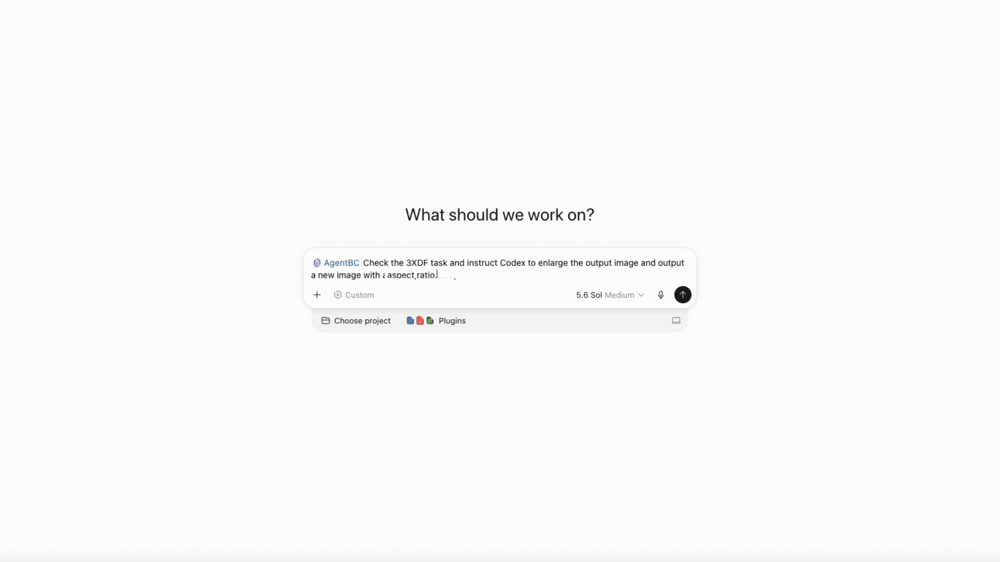
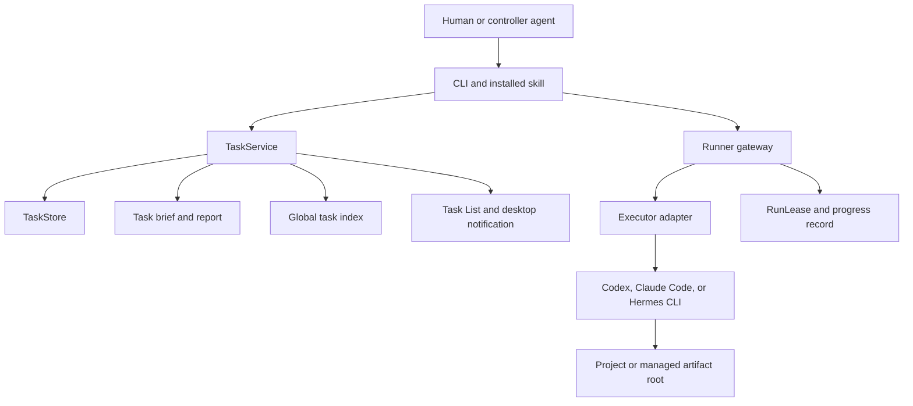

# Agent Bridge Connect

[中文](README_ZH.md) | English

AgentBC is a local-first task control system for running background work through
agents on your machine. The current release supports Codex/ChatGPT, Claude
Code, and Hermes. It gives different agent CLIs one task identity, one Runner
gateway, one report contract, and one recovery model.

> Public Alpha. Use AgentBC on development projects with version control and
> review agent output before accepting changes.

Current release: **1.0.1A3** (Python package version `1.0.1a3`).

- Repository and releases: [GitHub](https://github.com/roway49/agent-bridge-connect)
- Python package: [agentbc](https://pypi.org/project/agentbc/)
- CLI: `agentbc`

## Why AgentBC

- Dispatch work to local agents through one CLI.
- Keep continuation work in a visible chain such as `4XMC-001 -> 4XMC-002`.
- Write deliverables directly to a user project or an isolated managed workspace.
- Observe concurrent work through a compact, automatically managed task list.
- Separate readable task reports from bounded runtime records.
- Close, recover, reassign, or hand off work without relying on chat context.
- Receive concise macOS completion and recovery notifications.
- Send and receive tasks in natural language from any supported agent. See the
  [examples](docs/Example.md) for complete workflows.



## Create A Task

In any supported agent conversation, invoke `/agentbc`, describe the task in
natural language, and name the executor:

```text
/agentbc Ask Codex (or any supported agent) to write a document summarizing AgentBC's features and use cases.
```

## Requirements

- macOS for the current desktop notification and task-list workflow;
- Python 3.10 or newer;
- at least one installed and authenticated executor: Codex, Claude Code, or Hermes.

## Install And Verify

One command downloads, verifies, installs, and configures AgentBC:

```bash
curl -fsSL \
  https://github.com/roway49/agent-bridge-connect/releases/download/v1.0.1A3/install-agentbc-alpha.sh \
  | sh -s -- \
  https://github.com/roway49/agent-bridge-connect/releases/download/v1.0.1A3
```

For a package-managed installation from PyPI:

```bash
python3 -m pip install agentbc==1.0.1a3
agentbc setup
```

Start with [Quick Start](docs/QUICK_START.md), then use the
[User Guide](docs/USER_GUIDE.md) for task and Runner commands.

## Architecture

AgentBC is a local control plane. Agent integrations submit structured tasks to
one local Runner; Core owns task identity, state, reports, records, and
notifications.



### Component Boundaries

**CLI and skills.** The CLI exposes task, Runner, setup, record, worker, and
uninstall operations. Installed skills teach each controller how to select a
customer path, preserve dispatcher identity, and choose create versus handoff.
Skills cannot bypass Core validation and do not own task truth.

**TaskService and TaskStore.** `TaskService` owns state transitions, task-code
allocation, handoff lineage, close and recovery behavior, report finalization,
and index refresh. `TaskStore` owns compact runtime records. Each task iteration
has a bounded record budget so long-running agents do not create unbounded
metadata.

**Runner.** Runner is the normal dispatch gateway. It validates the task and
path plan, acquires a run lease, launches the executor, records low-frequency
progress evidence, and classifies executor termination. Runner does not decide
whether a deliverable is good; that remains a user or reviewer decision.

**Executor adapters.** Adapters translate one task packet into executor-specific
arguments and prompts. The executor CLI remains an independent process. Codex
and Claude receive scoped writable roots where supported; Hermes runs from the
selected project or artifact root and remains subject to its own CLI capabilities.

**Reports and records.** Readable task briefs and reports are separate from
compact machine state. Reports describe requirements, lineage, results, and
artifact locations; runtime records preserve exact status and recovery evidence.

## Task And Completion Model

A four-character `TASKCODE` identifies a task chain. The numeric suffix is its
iteration: `4XMC-001` and `4XMC-002` belong to the same chain. Commands may use
the task code to resolve the current head or the full ID for an exact iteration.

Successful execution requires one versioned terminal declaration. The executor's
final response must end with exactly one single-line marker:

```text
AGENTBC_FINAL_CALLBACK: {"version":1,"task_id":"4XMC-001","final_state":"completed","summary":"Implemented and verified the requested change","step_results":[{"id":1,"status":"done"}]}
```

`completed` is valid only when `task_id` matches and every declared task step
appears exactly once with status `done`. Missing or invalid JSON, wrong task IDs,
duplicate/unknown/missing steps, and non-`done` completion steps fail the flow.
`input_required` must be explicit and identify at least one declared step as
`blocked`; permission or approval prose alone is a failure. A two-option choice
declares a concrete decision reason and two label/description objects, for example
`"input":{"type":"choice","reason":"why a decision is required","options":[{"label":"A","description":"what A does"},{"label":"B","description":"what B does"}]}`.
Approve/deny requests use `"input":{"type":"permission","requested_permission":"full","reason":"..."}`:
a `safe` task may stop to request a one-time `full` continuation, which the user
approves or denies; a `full` task runs with its strongest documented noninteractive
access and does not ask. Plain approval prose never grants permissions or completes
a task. The desktop dialog explains the reason and both outcomes, then renders the two
labels as direct buttons. Operational deadline and CLI fallback fields remain in
the task record/report but are not shown in the desktop dialog. Input dialogs
remain visible for up to five minutes; dismissing or timing out leaves the task
waiting for a CLI response.

1. Runner confirms that execution started.
2. The executor emits and exits with its final marker.
3. Runner and Core validate only that flow declaration.
4. Core writes the terminal status and synchronizes the report.
5. Task List and desktop notifications display the same status.

- `completed`: a valid completed marker declares every task step done; quality is not asserted.
- `needs_recovery`: an explicit retryable transport or infrastructure failure stopped execution.
- `failed`: the marker or non-retryable execution contract was missing or invalid.

A zero exit is never completion by itself. AgentBC does not inspect Git state,
tests, files, or artifact quality when validating the flow marker, and it never
automatically retries a recovery state.

A dispatch response such as `accepted` is not task completion. Task status,
reports, artifacts, and notifications are the source of truth.

Every report and task brief includes a `Dispatcher Traceability` section labeling
the controller that created or handed off the task: `Dispatcher platform` and
`Dispatcher conversation ID`. These labels describe the current dispatcher
conversation, not the source task conversation and not the executor's temporary
session. The conversation ID shows `unavailable` when no trusted dispatcher ID
was available; AgentBC never guesses it from processes, paths, history, or a
previous task, and a handoff records the current dispatcher conversation.
AgentBC does not delete the dispatcher conversation.

## Path And Data Model

The controller supplies either an explicit user path or the literal
`"default path"`. Runner derives the path plan. Explicit paths receive
deliverables directly; default-path tasks receive an isolated managed artifact
root. Reports and runtime records always remain Core-owned.

```text
~/Documents/AgentBC/workspace/
|-- tasks/
|   |-- artifacts/YYYY-MM-DD/<TASKCODE>/
|   `-- report/YYYY-MM-DD/<TASKCODE>/
|       |-- <TASKCODE>-<NNN>-task.md
|       `-- <TASKCODE>-<NNN>-report.md
`-- record/
    |-- README.md
    |-- TASK_INDEX.md
    |-- task_index.jsonl
    `-- <TASKCODE>/<NNN>/
        |-- task.json
        |-- events.jsonl
        |-- interventions.jsonl
        |-- run_lease.json
        `-- bounded progress and run-log files
```

Each iteration record is capped at 10KB. `agentbc record clean` removes only eligible
terminal-task runtime diagnostics while preserving core indexes and state; reports are
never deleted by record cleanup. Empty managed
artifact directories are removed after terminal execution; customer projects
are never automatic-cleanup or uninstall targets.

## Configuration, Cleanup, And Health

- `agentbc claude budget <usd>` and `agentbc hermes max-turns <turns>` set the resource
  defaults for future executor runs; each task freezes its effective values at dispatch.
- `agentbc session retention status|enable|disable` controls whether executor temporary
  sessions survive terminal tasks. Cleanup is background and user-transparent: it manages
  only temporary sessions created by the Executor, and AgentBC never deletes the dispatcher
  conversation.
- `agentbc doctor` (or `agentbc doctor --json`) is a read-only installation and Runner health
  check with a fixed exit-code contract: `0` healthy, `1` warning, `2` unavailable.
- `agentbc task close <TASKCODE>` closes the current queued (pending) or active chain head;
  terminal and stale non-head iterations are rejected. Customer-project files are never
  deleted by close.

## Local Security Model

- Runner accepts authenticated local spool requests.
- One installation owns one Runner identity and stable PID; duplicate or orphaned
  startup is rejected even when spool state has been replaced.
- Customer paths are explicit task inputs and are never copied into the managed
  workspace as a permission workaround.
- Managed tasks receive a task-scoped artifact root rather than the workspace root.
- Report Markdown is Core-owned.
- Uninstall and task close never traverse customer project paths.

Runner uninstall honors two isolation controls:

- `AGENTBC_UNINSTALL_SKIP_RUNNER=1` skips stopping Runner and preserves its live
  spool, token, and pid files during uninstall.
- `AGENTBC_RUNNER_SPOOL=/path/to/spool` relocates the Runner spool used by the
  CLI, setup, and uninstall paths, letting tests and multi-install setups isolate
  the spool from the per-user default `/tmp/agentbc-runner-v2-<uid>`.

AgentBC is not a container sandbox. Use source control, normal OS permissions,
and executor-native approval controls for defense in depth.

## Documentation

- [Quick Start](docs/QUICK_START.md) / [快速开始](docs/QUICK_START_ZH.md)
- [User Guide](docs/USER_GUIDE.md) / [用户指南](docs/USER_GUIDE_ZH.md)
- [Feature Show](docs/FEATURE_SHOW.md) / [功能展示](docs/FEATURE_SHOW_ZH.md)
- [Examples](docs/Example.md) / [演示示例](docs/Example_ZH.md)
- [Feature Preview](docs/PREVIEW.md) / [后续功能预告](docs/PREVIEW_ZH.md)

## License

AgentBC is released under the [MIT License](LICENSE).
