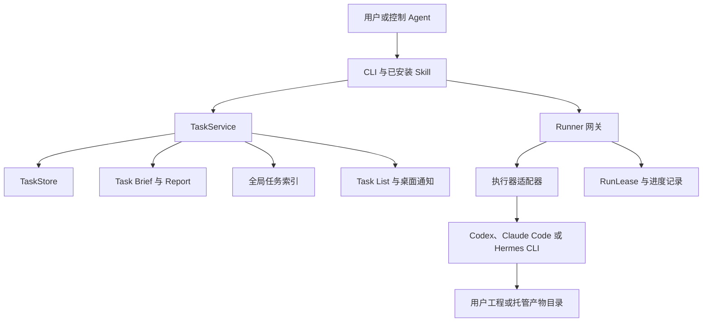

# Agent Bridge Connect

中文 | [English](README.md)

AgentBC 是一个本地优先的任务控制系统，用于协调本机 Agent 执行后台任务。
当前版本支持 Codex/ChatGPT、Claude Code 和 Hermes。它让不同 Agent CLI
共享统一的任务身份、Runner 网关、报告契约和恢复模型。

> Public Alpha：请在启用版本控制的开发项目中使用 AgentBC，并在接受改动前
> 审查 Agent 的输出。

当前版本：**1.0.2A**（Python 包版本为 `1.0.2a1`）。

内部开发候选：**1.0.3A**（Python 包 `1.0.3a1`）；该候选尚未公开发布。

- 仓库与版本发布：[GitHub](https://github.com/roway49/agent-bridge-connect)
- Python 包：[agentbc](https://pypi.org/project/agentbc/)
- CLI：`agentbc`

## 为什么使用 AgentBC

- 通过统一 CLI 将任务派发给本机 Agent。
- 用 `4XMC-001 -> 4XMC-002` 这样的可见任务链持续迭代。
- 将产物直接写入用户工程，或写入隔离的托管工作区。
- 通过紧凑、自动管理的 Task List 观察并发任务。
- 将可读任务报告与有容量上限的运行时记录分离。
- 无需依赖聊天上下文即可关闭、恢复、改派或 handoff 任务。
- 接收简洁的 macOS 完成与恢复通知。
- 通过自然语言在任意 Agent 中完成任务收发，详情参阅
  [演示示例](docs/Example_ZH.md)。


## 如何创建任务

在任意 Agent 对话中调用 `/agentbc`，使用自然语言描述任务并指定执行者：

```text
/agentbc 让 Codex（或任意受支持的 Agent）写一个文档，总结 AgentBC 的功能和用途。
```

## 环境要求

- 当前桌面通知和 Task List 工作流需要 macOS；
- Python 3.10 或更高版本；
- 至少安装并登录一个执行器：Codex、Claude Code 或 Hermes。

## 部署并校验

一行命令即可完成下载、校验、安装和配置：
```bash
curl -fsSL \
  https://github.com/roway49/agent-bridge-connect/releases/download/v1.0.2A/install-agentbc-alpha.sh \
  | sh -s -- \
  https://github.com/roway49/agent-bridge-connect/releases/download/v1.0.2A
```

也可以通过 PyPI 进行包管理安装：

```bash
python3 -m pip install agentbc==1.0.2a1
agentbc setup
```

请先阅读[快速开始](docs/QUICK_START_ZH.md)，任务与 Runner 命令详见
[用户指南](docs/USER_GUIDE_ZH.md)。

## 架构

AgentBC 是一个本地控制平面。Agent 集成将结构化任务提交给单一的本地
Runner；Core 负责任务身份、状态、报告、记录和通知。



### 组件边界

**CLI 与 Skills。** CLI 提供任务、Runner、setup、record、worker 和卸载操作。
安装后的 Skill 指导控制 Agent 选择 customer path、保留派发者身份，并在 create
与 handoff 之间做出选择。Skill 不能绕过 Core 校验，也不拥有任务事实。

**TaskService 与 TaskStore。** `TaskService` 负责状态流转、任务码分配、handoff
链路、关闭与恢复、报告终态化和索引刷新。`TaskStore` 负责紧凑运行时记录。
每次任务迭代都有容量上限，避免长时间任务无限增长元数据。

**Runner。** Runner 是正常派发的统一网关。它校验任务和路径计划，获取运行
租约，启动执行器，记录低频进度证据，并判断执行器退出状态。Runner 不判断
产物质量，质量验收仍由用户或审查者负责。

**执行器适配器。** 适配器将统一任务包转换为各执行器的参数和提示词。执行器
CLI 仍是独立进程。在能力允许时，Codex 和 Claude 会接收限定的可写目录；
Hermes 从指定工程或产物目录运行，并受其自身 CLI 能力约束。

**报告与记录。** 可读的 Task Brief、Report 与紧凑机器状态相互分离。报告描述
需求、链路、结果和产物位置；运行时记录保存精确状态和恢复证据。

## 任务与完成模型

四位 `TASKCODE` 标识一条任务链，数字后缀表示迭代次数：`4XMC-001` 和
`4XMC-002` 属于同一条链。命令可使用任务码解析当前 head，也可使用完整 ID
精确定位某次迭代。

成功执行要求一个版本化的终态声明。执行器的最终回复必须以单行恰好一个标记结束：

```text
AGENTBC_FINAL_CALLBACK: {"version":1,"task_id":"4XMC-001","final_state":"completed","summary":"已实现并验证请求的改动","step_results":[{"id":1,"status":"done"}]}
```

`completed` 只有在 `task_id` 匹配、且每个声明的步骤恰好出现一次并标记为 `done` 时才有效。
JSON 缺失或无效、task ID 错误、步骤重复/未知/缺失以及非 `done` 的完成步骤都会使流程失败。
`input_required` 必须显式声明至少一个 `blocked` 步骤；单独的权限或批准文字属于失败。两步
选项必须声明具体决策原因和两个 label/description 对象，例如
`"input":{"type":"choice","reason":"为什么需要用户决定","options":[{"label":"A","description":"A 做什么"},{"label":"B","description":"B 做什么"}]}`。
批准/拒绝请求使用 `"input":{"type":"permission","requested_permission":"full","reason":"..."}`：
`safe` 任务可以停下来请求一次性 `full` 延续，由用户批准或拒绝；`full` 任务直接使用其最强
文档化非交互访问，不再询问。普通批准文字既不能授予权限，也不能完成任务。桌面弹窗解释原因
和两种结果，并把两个 label 渲染为直接按钮。运维 deadline 与 CLI 兜底字段保留在任务
记录/报告中，但不显示在桌面弹窗。普通 message/choice 弹窗最长等待五分钟；关闭或超时后
任务继续等待 CLI 响应。权限弹窗严格只有允许/拒绝、不接受文本，默认拒绝，并在关闭或超时
时自动拒绝。

1. Runner 确认执行已启动。
2. 执行器输出其最终标记并退出。
3. Runner 与 Core 只校验该流程声明。
4. Core 写入终态并同步 Report。
5. Task List 与桌面通知展示相同状态。

- `completed`：合法的 completed 标记声明所有任务步骤 done；不代表质量已通过验收。
- `needs_recovery`：显式可重试的传输或基础设施失败中止了执行。
- `failed`：标记缺失或无效，或存在不可重试的执行契约违规。

零退出本身永远不算完成。AgentBC 校验流程标记时不检查 Git、测试、文件或产物质量，也绝不
自动重试恢复状态。

`accepted` 等派发响应不代表任务完成。任务状态、报告、产物和通知才是事实来源。

每份报告与 task brief 都包含 `Dispatcher Traceability`（派发者溯源）小节，标注创建或 handoff
任务的控制端：`Dispatcher platform`（派发平台）和 `Dispatcher conversation ID`（派发会话 ID）。
这些标签描述的是当前派发者会话，而不是源任务会话，也不是执行器的临时会话。当没有可信的
派发者 ID 时会话 ID 显示为 `unavailable`；AgentBC 绝不从进程、路径、历史记录或上一个任务中
猜测该 ID，handoff 记录的是当前派发者会话。AgentBC 不会删除派发者会话。

## 路径与数据模型

控制 Agent 只需提供明确的用户路径或字面值 `"default path"`，Runner 据此生成
路径计划。明确路径的产物直接写入用户工程；默认路径任务使用隔离的托管产物
目录。报告与运行时记录始终由 Core 管理。

```text
~/Documents/AgentBC/workspace/
|-- tasks/
|   |-- artifacts/YYYY-MM-DD/<TASKCODE>/
|   `-- report/YYYY-MM-DD/<TASKCODE>/
|       |-- <TASKCODE>-<NNN>-task.md
|       `-- <TASKCODE>-<NNN>-report.md
`-- record/
    |-- README.md
    |-- TASK_INDEX.md
    |-- task_index.jsonl
    `-- <TASKCODE>/<NNN>/
        |-- task.json
        |-- events.jsonl
        |-- interventions.jsonl
        |-- run_lease.json
        `-- 有容量限制的进度与运行日志
```

每次迭代的 record 上限为 10KB。`agentbc record clean` 只删除符合条件的终态任务运行时
诊断，同时保留核心索引和状态；record clean 永远不会删除报告。终态任务的空托管产物目录会
自动删除；用户工程永远不会成为自动清理或卸载目标。

## 配置、清理与健康

- `agentbc claude budget <usd>` 与 `agentbc hermes max-turns <turns>` 设置后续 Executor run
  的资源默认值；每个任务在派发时冻结其生效值。
- `agentbc session retention status|enable|disable` 控制执行器临时会话在终态任务后是否保留。
  清理在后台无感执行：只管理 Executor 创建的临时会话，AgentBC 永远不会删除派发者会话。
- `agentbc doctor`（或 `agentbc doctor --json`）是只读的安装与 Runner 健康检查，退出码契约
  固定：`0` healthy、`1` warning、`2` unavailable。
- `agentbc task close <TASKCODE>` 只关闭当前排队中（pending）或活跃的 chain head；终态与
  过期非 head 迭代都会被拒绝。close 永远不会删除用户工程文件。

## 本地安全模型

- Runner 只接受经过本地 token 认证的 spool 请求。
- 每套安装只允许一个 Runner 身份和稳定 PID；即使 spool 状态被替换，重复或
  孤儿 Runner 启动也会被拒绝。
- customer path 是明确任务输入，不会为了绕过权限而复制进托管工作区。
- 托管任务只获得当前任务的产物目录，而非整个 workspace 根目录。
- Report Markdown 由 Core 管理。
- 卸载和 task close 不会遍历用户工程路径。

Runner 卸载遵循两个隔离控制项：

- `AGENTBC_UNINSTALL_SKIP_RUNNER=1` 在卸载时跳过停止 Runner，并保留其运行中的
  spool、token 与 pid 文件。
- `AGENTBC_RUNNER_SPOOL=/path/to/spool` 可重定位 CLI、setup 与卸载路径使用的
  Runner spool，便于测试与多实例安装隔离默认的 `/tmp/agentbc-runner-v2-<uid>`。

AgentBC 不是容器沙箱。请结合版本控制、操作系统权限和执行器自身的审批机制
进行纵深防护。

## 文档

- [快速开始](docs/QUICK_START_ZH.md) / [Quick Start](docs/QUICK_START.md)
- [用户指南](docs/USER_GUIDE_ZH.md) / [User Guide](docs/USER_GUIDE.md)
- [发布流程](docs/RELEASE_PROCESS_ZH.md) / [Release Process](docs/RELEASE_PROCESS.md)
- [功能展示](docs/FEATURE_SHOW_ZH.md) / [Feature Show](docs/FEATURE_SHOW.md)
- [演示示例](docs/Example_ZH.md) / [Examples](docs/Example.md)
- [后续功能预告](docs/PREVIEW_ZH.md) / [Feature Preview](docs/PREVIEW.md)

## 许可证

AgentBC 使用 [MIT License](LICENSE) 开源。
