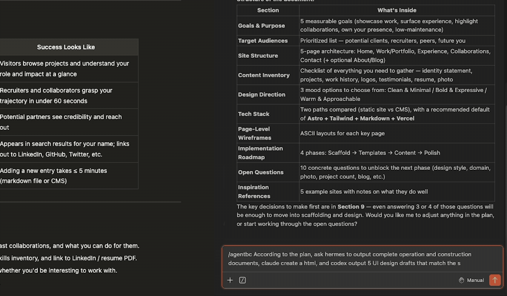
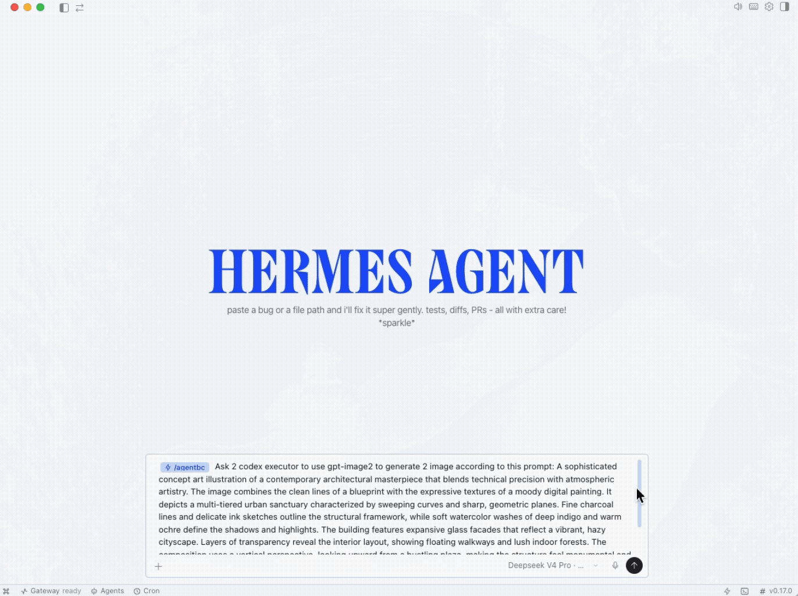
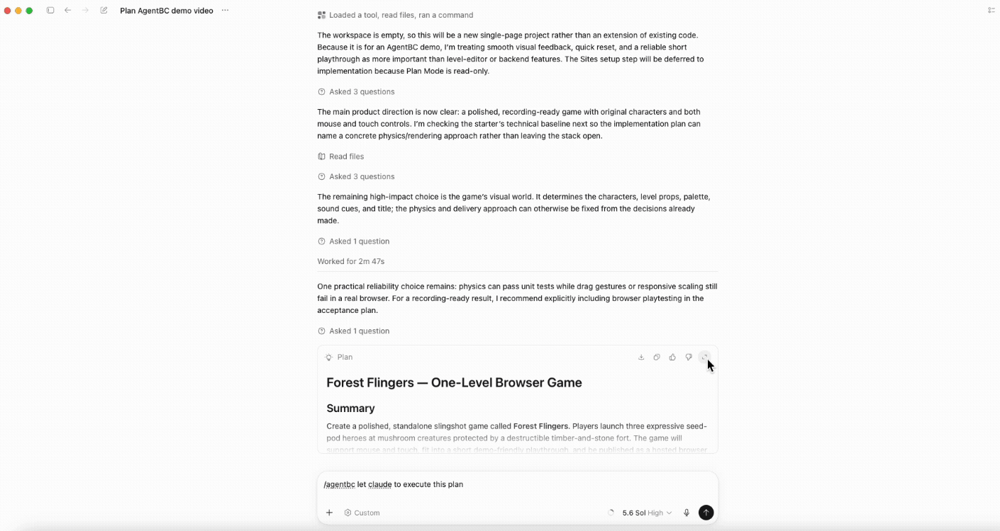
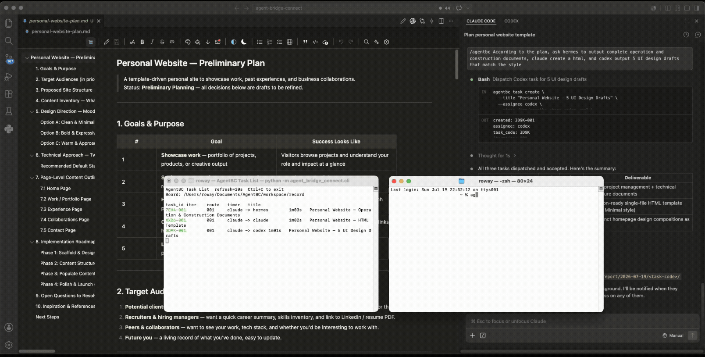
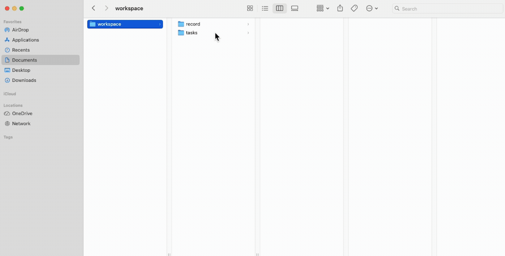

# Examples

[中文](Example_ZH.md) | English

This page uses real interaction recordings to show typical AgentBC `1.0.1A3`
workflows. It focuses on the user experience; see the
[Feature Show](FEATURE_SHOW.md) and [User Guide](USER_GUIDE.md) for complete
commands and behavior.

## 1. Dispatch Concurrent Tasks In Natural Language

Describe multiple tasks and their executors in one conversation. AgentBC gives
each item an independent task identity and submits them to Runner for concurrent
execution. Once dispatch is accepted, the controller agent does not need to
poll or remain in the foreground.

## 2. Run Multiple Executors Of The Same Type

A single dispatch round can assign independent work to multiple executors of
the same type. Every task keeps its own ID, runtime state, and report, making
this flow suitable for unrelated batch work.

## 3. Plan With One Agent, Execute With Another

A controller agent can turn a request into a structured task and explicitly
assign execution to another agent. Planning, execution, and reporting remain
inside one task protocol, reducing information loss between agents.

## 4. Continue Work With Only A Task ID

A new agent or conversation does not need the original chat context. The task
ID locates the brief, report, and artifacts, while handoff continues the next
iteration inside the same task chain.

## 5. Inspect Status, Cancel Work, And Receive Notifications

Task List keeps the current dispatch cohort visible in one place. Users can
close tasks that are running or waiting to start, and AgentBC sends concise
desktop notifications when tasks complete or require recovery.

## 6. Keep Artifacts, Reports, And Runtime Records Organized

The managed workspace stores deliverables, readable task reports, and compact
runtime records separately. Users and agents can locate results by task ID
without mixing AgentBC runtime files into a customer project.

