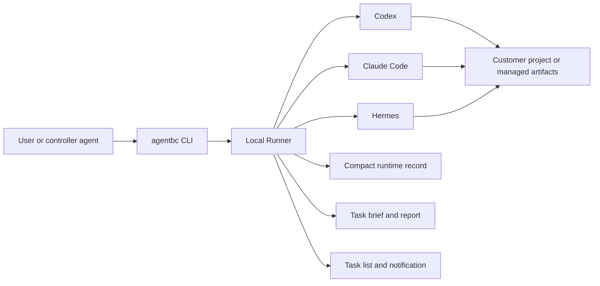

# Feature Show

[中文](FEATURE_SHOW_ZH.md) | English

This walkthrough demonstrates the Public Alpha behavior with real CLI commands.



## 1. Discover Local Agents

```bash
agentbc setup
agentbc setup --show
agentbc runner status
```

Setup discovers executor-owned CLI locations, installs integrations, and starts
one local Runner. AgentBC does not require a cloud coordination service.


## 2. Atomic Create And Dispatch

```bash
agentbc task create \
  --title "Add CSV export" \
  --assignee codex \
  --steps ./steps.yaml \
  --customer-path /path/to/project \
  --source-platform claude \
  --dispatch
```

Create plus `--dispatch` allocates a task ID and submits it through Runner as
one operation. The route appears as `claude -> codex` in Task List and reports.


## 3. Two Deliberate Path Modes

Use an explicit file or directory when work belongs to a user project:

```bash
agentbc task create ... --customer-path /path/to/project --dispatch
```

Use the managed workspace only when no project path was supplied:

```bash
agentbc task create ... --customer-path "default path" --dispatch
```

Customer tasks write deliverables directly to the project. Managed tasks work
inside a task-scoped artifact directory; neither mode lets executor output use
the AgentBC workspace root as a general scratch directory.

## 4. Continue Through A Task Chain

```bash
agentbc task handoff 4XMC --to hermes \
  --message "Review the previous implementation and improve error handling" \
  --source-platform codex \
  --dispatch
```

The chain keeps `4XMC` and advances from `001` to `002`. Work that depends on
existing AgentBC deliverables is a handoff even when the natural-language
request only says "continue" or "modify the previous result". Core rejects a
new root task that points back into an existing managed artifact directory.


## 5. Watch Concurrent Work

```bash
agentbc task list
agentbc runner show
```

Task List keeps the current dispatch cohort in one terminal. It shows a colored
task ID, iteration, dispatcher-to-executor route, display timer, and title. The
timer only proves the list is refreshing; health is checked by the low-frequency
progress monitor.

- green: recent progress;
- yellow: no progress update for at least five minutes while Runner is healthy;
- orange: no progress update for at least ten minutes while Runner is healthy;
- red: recovery or exit failure;
- gray: waiting to start.

Terminal rows remain visible as `completed` or `failed` until the whole cohort
reaches a terminal state, then the Task List window closes.


## 6. Verify Without Chat Context

```bash
agentbc task status 4XMC
agentbc task report 4XMC
agentbc task logs 4XMC
```

These commands let a new agent session locate prior work through task identity,
the global index, reports, and artifacts instead of depending on chat history.


## 7. Close And Recover Deliberately

```bash
agentbc task close 4XMC
agentbc task recover 4XMC
```

Close only targets an active head. Root-task close removes AgentBC-owned files
and releases its code; later chain iterations preserve prior history and warn
that project changes cannot be rolled back. Recovery remains explicit when a
task did not execute normally.


## 8. Remove The Product Without Touching Projects

```bash
agentbc uninstall
```

Records/reports and managed artifacts are separate deletion choices. AgentBC
never traverses customer project paths during uninstall.
