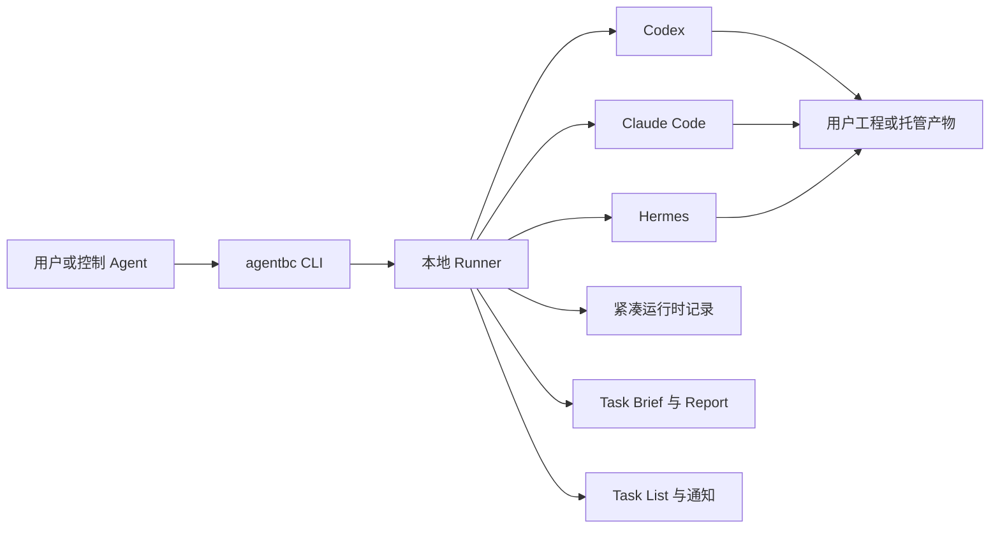

# 功能展示

中文 | [English](FEATURE_SHOW.md)

以下流程用真实 CLI 命令展示 Public Alpha 的核心行为。



## 1. 发现本地 Agent

```bash
agentbc setup
agentbc setup --show
agentbc runner status
```

setup 会发现执行器自身的 CLI 路径、安装集成，并启动唯一的本地 Runner。
AgentBC 不依赖云端协调服务。


## 2. 原子化创建与派发

```bash
agentbc task create \
  --title "Add CSV export" \
  --assignee codex \
  --steps ./steps.yaml \
  --customer-path /path/to/project \
  --source-platform claude \
  --dispatch
```

create 加 `--dispatch` 会在一次操作中分配任务 ID 并通过 Runner 提交。Task List
与报告中的 route 会显示为 `claude -> codex`。


## 3. 两种明确的路径模式

当任务属于用户工程时，传递明确的文件或目录：

```bash
agentbc task create ... --customer-path /path/to/project --dispatch
```

只有用户没有指定工程路径时才使用托管工作区：

```bash
agentbc task create ... --customer-path "default path" --dispatch
```

customer task 将产物直接写入用户工程。managed task 在当前任务专属的 artifact
目录工作；两种模式都不允许执行器把 AgentBC workspace 根目录当作通用临时目录。

## 4. 通过任务链继续工作

```bash
agentbc task handoff 4XMC --to hermes \
  --message "Review the previous implementation and improve error handling" \
  --source-platform codex \
  --dispatch
```

任务链保持 `4XMC` 不变，并从 `001` 递增到 `002`。任何依赖已有 AgentBC
产物的工作都应使用 handoff，即使自然语言只说“继续”或“修改之前的结果”。若新
根任务指向已有托管产物目录，Core 会拒绝该操作。


## 5. 观察并发工作

```bash
agentbc task list
agentbc runner show
```

Task List 在一个终端中保留当前派发批次，展示带颜色的任务 ID、迭代、派发者到
执行者 route、界面计时器和标题。计时器仅证明 Task List 正在刷新，健康状态由
低频进度监测判断。

- 绿色：近期存在进度；
- 黄色：Runner 正常，但至少五分钟没有进度更新；
- 橙色：Runner 正常，但至少十分钟没有进度更新；
- 红色：需要恢复或退出失败；
- 灰色：等待启动。

终态任务会以 `completed` 或 `failed` 保留在列表中，直到当前批次全部进入终态，
随后 Task List 窗口关闭。


## 6. 不依赖聊天上下文验收

```bash
agentbc task status 4XMC
agentbc task report 4XMC
agentbc task logs 4XMC
```

新的 Agent 会话可以通过任务身份、全局索引、报告和产物定位历史工作，无需依赖
之前的聊天上下文。


## 7. 关闭与恢复任务

```bash
agentbc task close 4XMC
agentbc task recover 4XMC
```

close 只针对当前活跃 head。关闭根任务会删除 AgentBC 自有文件并释放任务码；
关闭后续迭代会保留历史，并提示工程改动无法回滚。未正常执行的任务必须由用户
明确决定是否恢复。


## 8. 卸载产品但不触碰用户工程

```bash
agentbc uninstall
```

卸载时可分别决定是否删除 record/report 和托管 artifacts。AgentBC 不会在卸载
过程中遍历或删除用户工程路径。
